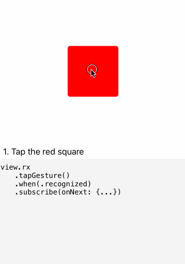

# RxGesture

[](http://cocoapods.org/pods/RxGesture)
[](http://cocoapods.org/pods/RxGesture)
[](http://cocoapods.org/pods/RxGesture)

## Usage



To run the example project, clone the repo, in the __Example__ folder open `RxGesture.xcworkspace`.

You _might_ need to run `pod install` from the Example directory first.

---

__RxGesture__ allows you to easily turn any view into a tappable or swipeable control like so:

```swift
view.rx
  .tapGesture()
  .when(.recognized)
  .subscribe(onNext: { _ in
    //react to taps
  })
  .disposed(by: stepBag)
```

You can also react to more than one  gesture. For example to dismiss a photo preview you might want to do that when the user taps it, or swipes up or down:

```swift
view.rx
  .anyGesture(.tap(), .swipe([.up, .down]))
  .when(.recognized)
  .subscribe(onNext: { _ in
    //dismiss presented photo
  })
  .disposed(by: stepBag)
```

`rx.gesture` is defined as `Observable<G>` where `G` is the actual type of the gesture recognizer so what it emits is the gesture recognizer itself (handy if want to call methods like `asLocation(in view:)` or `asTranslation(in view:)`)


#### On iOS, RxGesture supports:

```swift
view.rx.tapGesture()           -> ControlEvent<UITapGestureRecognizer>
view.rx.pinchGesture()         -> ControlEvent<UIPinchGestureRecognizer>
view.rx.swipeGesture(.left)    -> ControlEvent<UISwipeGestureRecognizer>
view.rx.panGesture()           -> ControlEvent<UIPanGestureRecognizer>
view.rx.longPressGesture()     -> ControlEvent<UILongPressGestureRecognizer>
view.rx.rotationGesture()      -> ControlEvent<UIRotationGestureRecognizer>
view.rx.screenEdgePanGesture() -> ControlEvent<UIScreenEdgePanGestureRecognizer>

view.rx.anyGesture(.tap(), ...)           -> ControlEvent<UIGestureRecognizer>
view.rx.anyGesture(.pinch(), ...)         -> ControlEvent<UIGestureRecognizer>
view.rx.anyGesture(.swipe(.left), ...)    -> ControlEvent<UIGestureRecognizer>
view.rx.anyGesture(.pan(), ...)           -> ControlEvent<UIGestureRecognizer>
view.rx.anyGesture(.longPress(), ...)     -> ControlEvent<UIGestureRecognizer>
view.rx.anyGesture(.rotation(), ...)      -> ControlEvent<UIGestureRecognizer>
view.rx.anyGesture(.screenEdgePan(), ...) -> ControlEvent<UIGestureRecognizer>
```

#### On macOS, RxGesture supports:

```swift
view.rx.clickGesture()         -> ControlEvent<NSClickGestureRecognizer>
view.rx.rightClickGesture()    -> ControlEvent<NSClickGestureRecognizer>
view.rx.panGesture()           -> ControlEvent<NSPanGestureRecognizer>
view.rx.pressGesture()         -> ControlEvent<NSPressGestureRecognizer>
view.rx.rotationGesture()      -> ControlEvent<NSRotationGestureRecognizer>
view.rx.magnificationGesture() -> ControlEvent<NSMagnificationGestureRecognizer>

view.rx.anyGesture(.click(), ...)         -> ControlEvent<NSGestureRecognizer>
view.rx.anyGesture(.rightClick(), ...)    -> ControlEvent<NSGestureRecognizer>
view.rx.anyGesture(.pan(), ...)           -> ControlEvent<NSGestureRecognizer>
view.rx.anyGesture(.press(), ...)         -> ControlEvent<NSGestureRecognizer>
view.rx.anyGesture(.rotation(), ...)      -> ControlEvent<NSGestureRecognizer>
view.rx.anyGesture(.magnification(), ...) -> ControlEvent<NSGestureRecognizer>
```


ℹ️ If you use a gesture recognizer alone, prefer the `view.rx.fooGesture()` syntax over `view.rx.anyGesture(.foo())` because it returns the concrete `UIGestureRecognizer` subclass and avoid you to cast it in `subscribe()`.


## Filtering State

By default, there is no filter on the state of the gesture recognizer. That means that you will always receive a first event with the initial state of the gesture recognizer (almost always `.possible`).

Here are the preferred states that can be used for each kind of gestures (__iOS__ and __macOS__):

Kind | States
---|---
`.tap()` `.click()` `.rightClick()` `.swipe()`| `.recognized`
`.longPress()` `.press()` | `.began`
`.pan()` `.pinch()` `.rotation()` `.magnification()` `.screenEdgePan()` | `.began` `.changed` `.ended`

You usually filter the state using the `.when()` operator:
```swift
view.rx.tapGesture().when(.recognized)
view.rx.panGesture().when(.began, .changed, .ended)
```

If you are observing multiple gestures at once, you can use the `.when()` operator if you want to filter against the same state for __all__ gesture recognizers, or use the tuple syntax for individual filtering:

```swift
view.rx
  .anyGesture(.tap(), .swipe([.up, .down]))
  .when(.recognized)
  .subscribe(onNext: { gesture in
    // Called whenever a tap, a swipe-up or a swipe-down is recognized (state == .recognized)
  })
  .disposed(by: bag)

view.rx
  .anyGesture(
    (.tap(), when: .recognized),
    (.pan(), when: .ended)
  )
  .subscribe(onNext: { gesture in
    // Called whenever:
    // - a tap is recognized (state == .recognized)
    // - or a pan is ended (state == .ended)
  })
  .disposed(by: bag)
```


__The demo app includes examples for all recognizers ➡️ [iOS](Example/RxGesture/ViewController.swift), [macOS](Example/RxGesture-OSX/ViewController.swift)__.

## Delegate customization
### Lightweight customization
Each gesture recognizer has a default `RxGestureRecognizerDelegate`. It allows you to customize every delegate method using a policy:
- `.always` will return `true` to the corresponding delegate method
- `.never` will return `false` to the corresponding delegate method
- `.custom` takes an associated closure that will be executed to return a value to the corresponding delegate method

Here are the available policies with their corresponding delegate method:
```swift
beginPolicy                   -> gestureRecognizerShouldBegin(:_)
touchReceptionPolicy          -> gestureRecognizer(_:shouldReceive:)
selfFailureRequirementPolicy  -> gestureRecognizer(_:shouldBeRequiredToFailBy:)
otherFailureRequirementPolicy -> gestureRecognizer(_:shouldRequireFailureOf:)
simultaneousRecognitionPolicy -> gestureRecognizer(_:shouldRecognizeSimultaneouslyWith:)
eventRecognitionAttemptPolicy -> gestureRecognizer(_:shouldAttemptToRecognizeWith:) // macOS only
pressReceptionPolicy          -> gestureRecognizer(_:shouldReceive:) // iOS only
```

This delegate can be customized in the configuration closure:
```swift
view.rx.tapGesture(configuration: { gestureRecognizer, delegate in
  delegate.simultaneousRecognitionPolicy = .always // (default value)
  // or
  delegate.simultaneousRecognitionPolicy = .never
  // or
  delegate.simultaneousRecognitionPolicy = .custom { gestureRecognizer, otherGestureRecognizer in
    return otherGestureRecognizer is UIPanGestureRecognizer
  }
  delegate.otherFailureRequirementPolicy = .custom { gestureRecognizer, otherGestureRecognizer in
    return otherGestureRecognizer is UILongPressGestureRecognizer
  }
})
```

Default values can be found in [`RxGestureRecognizerDelegate.swift`](Pod/Classes/RxGestureRecognizerDelegate.swift#L56).

### Full customization
You can also replace the default delegate by your own, or remove it.
```swift
view.rx.tapGesture { [unowned self] gestureRecognizer, delegate in
  gestureRecognizer.delegate = nil
  // or
  gestureRecognizer.delegate = self
}
```

## Requirements

This library depends on both __RxSwift__ and __RxCocoa__.


## Installation

### [CocoaPods](https://guides.cocoapods.org/using/using-cocoapods.html)

Add this to `Podfile`

```swift
pod "RxGesture"
```

```bash
$ pod install
```

### [Carthage](https://github.com/Carthage/Carthage)

Add this to `Cartfile`

```
github "RxSwiftCommunity/RxGesture" ~> 1.1.1
```

```bash
$ carthage update
```

## Thanks

Everyone in the RxSwift Slack channel 💯

## License

RxGesture is available under the MIT license. See the LICENSE file for more info.
