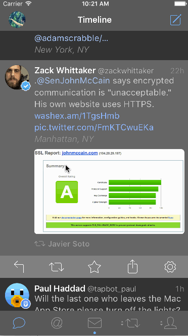

# XLActionController

<p align="left">
<a href="https://travis-ci.org/xmartlabs/XLActionController"></a>

<a href="https://developer.apple.com/swift"></a>
<a href="https://github.com/Carthage/Carthage"></a>
<a href="https://cocoapods.org/pods/XLActionController"></a>
<a href="https://raw.githubusercontent.com/xmartlabs/XLActionController/master/LICENSE"></a>
<!-- <a href="https://codebeat.co/projects/github-com-xmartlabs-xlactioncontroller"></a> -->
</p>

By [XMARTLABS](http://xmartlabs.com).

**XLActionController** is an extensible library to quickly create any custom action sheet controller.

## Examples

<table>
 <tr>
  <td>
    
  </td>
  <td>
    
  </td>
  <td>
    
  </td>
 </tr>
 <tr>
  <td>
    
  </td>
  <td>
    
  </td>
  <td>
    
  </td>
 </tr>
 </table>

The action sheet controllers shown above were entirely created using XLActionController and are included in the [Examples](/Example/CustomActionControllers).
To run the Example project: clone XLActionController repository, open XLActionController workspace and run the Example project.

The code snippet below shows how to present the Tweetbot action sheet controller:

```swift
let actionController = TweetbotActionController()

actionController.addAction(Action("View Details", style: .default, handler: { action in
  // do something useful
}))
actionController.addAction(Action("View Retweets", style: .default, handler: { action in
  // do something useful
}))
actionController.addAction(Action("View in Favstar", style: .default, handler: { action in
  // do something useful
}))
actionController.addAction(Action("Translate", style: .default, executeImmediatelyOnTouch: true, handler: { action in
  // do something useful
}))

actionController.addSection(Section())
actionController.addAction(Action("Cancel", style: .cancel, handler:nil))

present(actionController, animated: true, completion: nil)
```

As you may have noticed, the library usage looks pretty similar to UIAlertController.

Actions' handlers are executed after the alert controller is dismissed from screen. If you want, you can change this passing `true` to the action's constructor to the argument `executeImmediatelyOnTouch`.

> Behind the scenes XLActionController uses a UICollectionView to display the action sheet.

## Usage

First create a custom action sheet view controller by extending from the `ActionController` generic class. For details on how to create a custom action sheet controller look at the [Extensibility](#extensibility) section.

For instance, let's suppose we've already created [`TwitterActionController`](Example/CustomActionControllers/Twitter.swift).

```swift
// Instantiate custom action sheet controller
let actionSheet = TwitterActionController()
// set up a header title
actionSheet.headerData = "Accounts"
// Add some actions, note that the first parameter of `Action` initializer is `ActionData`.
actionSheet.addAction(Action(ActionData(title: "Xmartlabs", subtitle: "@xmartlabs", image: UIImage(named: "tw-xmartlabs")!), style: .default, handler: { action in
   // do something useful
}))
actionSheet.addAction(Action(ActionData(title: "Miguel", subtitle: "@remer88", image: UIImage(named: "tw-remer")!), style: .default, handler: { action in
   // do something useful
}))
// present actionSheet like any other view controller
present(actionSheet, animated: true, completion: nil)
```


As the code above illustrates, there are no relevant differences compared to the UIAlertController API.

The main difference is that XLActionController works with any header data type and not only the standard UIAlertController `title` and `message` properties.
Similarly XLActionController's Action works with any data Type and not only the `title` string.

```swift
// XLActionController:
xlActionController.headerData = SpotifyHeaderData(title: "The Fast And The Furious Soundtrack Collection", subtitle: "Various Artists", image: UIImage(named: "sp-header-icon")!)

// vs UIAlertController:
uiActionController.title = "The Fast And The Furious Soundtrack Collection" // no way to pass an image
uiActionController.message = "Various Artists"
```

```swift
// XLActionController:
let xlAction = Action(ActionData(title: "Save Full Album", image: UIImage(named: "sp-add-icon")!), style: .default, handler: { action in })
// notice that we are able to pass an image in addition to the title
xlActionController.addAction(xlAction)

// vs UIAlertController:
let uiAction = UIAlertAction(title: "Xmartlabs", style: .default, handler: { action in }))
uiActionController.addAction(uiAction)
```

> This can be accomplished because XLActionController is a generic type.

Another important difference is that XLActionController provides a way to add action sections as illustrated in the code below:

```swift
  actionController.addSection(Section())
```

and also each section has a `data` property. This property is generic, so that it can hold any type. This data will be used to create this section's header view.

```swift
let section = actionController.addSection(Section())
section.data = "String" // assuming section data Type is String
```

> Each section contains a set of actions. We typically use sections to show a header view above a set of actions.


## Extensibility

ActionController uses a UICollectionView to show actions and headers on screen. Actions will be rendered as instances of UICollectionViewCell. You can use
your own subclass of UICollectionViewCell by specifying it in the action controller declaration. Additionally, ActionController allows you to specify a global header and a section header. Headers are shown as collection view's supplementary views.

The `ActionController` class is a generic type that works with any cell, header, section header type and its associated data types.

### Create your custom action sheet controller

XLActionController provides extension points to specify a whole new look and feel to our custom sheet controller and to tweak present and dismiss animations. Let's see an example:

```swift
// As first step we should extend the ActionController generic type
public class PeriscopeActionController: ActionController<PeriscopeCell, String, PeriscopeHeader, String, UICollectionReusableView, Void> {

    // override init in order to customize behavior and animations
    public override init(nibName nibNameOrNil: String? = nil, bundle nibBundleOrNil: Bundle? = nil) {
        super.init(nibName: nibNameOrNil, bundle: nibBundleOrNil)
        // customizing behavior and present/dismiss animations
        settings.behavior.hideOnScrollDown = false
        settings.animation.scale = nil
        settings.animation.present.duration = 0.6
        settings.animation.dismiss.duration = 0.5
        settings.animation.dismiss.options = .curveEaseIn
        settings.animation.dismiss.offset = 30

        // providing a specific collection view cell which will be used to display each action, height parameter expects a block that returns the cell height for a particular action.
        cellSpec = .nibFile(nibName: "PeriscopeCell", bundle: Bundle(for: PeriscopeCell.self), height: { _ in 60})
        // providing a specific view that will render each section header.
        sectionHeaderSpec = .cellClass(height: { _ in 5 })
        // providing a specific view that will render the action sheet header. We calculate its height according the text that should be displayed.
        headerSpec = .cellClass(height: { [weak self] (headerData: String) in
            guard let me = self else { return 0 }
            let label = UILabel(frame: CGRect(x: 0, y: 0, width: me.view.frame.width - 40, height: CGFloat.greatestFiniteMagnitude))
            label.numberOfLines = 0
            label.font = .systemFontOfSize(17.0)
            label.text = headerData
            label.sizeToFit()
            return label.frame.size.height + 20
        })

        // once we specify the views, we have to provide three blocks that will be used to set up these views.
        // block used to setup the header. Header view and the header are passed as block parameters
        onConfigureHeader = { [weak self] header, headerData in
            guard let me = self else { return }
            header.label.frame = CGRect(x: 0, y: 0, width: me.view.frame.size.width - 40, height: CGFloat.greatestFiniteMagnitude)
            header.label.text = headerData
            header.label.sizeToFit()
            header.label.center = CGPoint(x: header.frame.size.width  / 2, y: header.frame.size.height / 2)
        }
        // block used to setup the section header
        onConfigureSectionHeader = { sectionHeader, sectionHeaderData in
            sectionHeader.backgroundColor = UIColor(white: 0.95, alpha: 1.0)
        }
        // block used to setup the collection view cell
        onConfigureCellForAction = { [weak self] cell, action, indexPath in
            cell.setup(action.data, detail: nil, image: nil)
            cell.separatorView?.isHidden = indexPath.item == self!.collectionView.numberOfItems(inSection: indexPath.section) - 1
            cell.alpha = action.enabled ? 1.0 : 0.5
            cell.actionTitleLabel?.textColor = action.style == .destructive ? UIColor(red: 210/255.0, green: 77/255.0, blue: 56/255.0, alpha: 1.0) : UIColor(red: 0.28, green: 0.64, blue: 0.76, alpha: 1.0)
        }
    }
}
```

ActionController type declaration:
```swift
public class ActionController<ActionViewType: UICollectionViewCell, ActionDataType, HeaderViewType: UICollectionReusableView, HeaderDataType, SectionHeaderViewType: UICollectionReusableView, SectionHeaderDataType>
```

When extending ActionController we must specify the following view types ActionViewType, HeaderViewType, SectionHeaderViewType. These types are the cell type used to render an action, the view used to render the action sheet header and the view used to render the section header.

Each view type has its associated data: ActionDataType, HeaderDataType, SectionHeaderDataType respectively.

> If your custom action sheet doesn't have a header view we can use `UICollectionReusableView` as `HeaderViewType` and `Void` as `HeaderDataType`.
> If it doesn't have a section header view you can use `UICollectionReusableView` as `SectionHeaderViewType` and `Void` as `SectionHeaderDataType`.

The code below shows how we specify these types for the action controllers provided in the example project:
```swift
class PeriscopeActionController: ActionController<PeriscopeCell, String, PeriscopeHeader, String, UICollectionReusableView, Void> { ... } // doesn't need to show a section header
class SpotifyActionController: ActionController<SpotifyCell, ActionData, SpotifyHeaderView, SpotifyHeaderData, UICollectionReusableView, Void> { ... } // doesn't need to show a section header
class TwitterActionController: ActionController<TwitterCell, ActionData, TwitterActionControllerHeader, String, UICollectionReusableView, Void> { ... } // doesn't need to show a section header
class YoutubeActionController: ActionController<YoutubeCell, ActionData, UICollectionReusableView, Void, UICollectionReusableView, Void>
```

### Tweaking default style and animation parameters

By following the previous section steps you should already be able to play with your custom action controller.
It happens quite often that we need some other customization such as zooming out the presenting view, changing the status bar color or customizing the default present and dismiss animation.

`ActionController` class defines the `settings` property of type `ActionSheetControllerSettings` to tweak all these.

#### UICollectionView's behavior
```swift
// Indicates if the action controller must be dismissed when the user taps the background view. `true` by default.
settings.behavior.hideOnTap: Bool
// Indicates if the action controller must be dismissed when the user scrolls down the collection view. `true` by default.
settings.behavior.hideOnScrollDown: Bool
// Indicates if the collectionView's scroll is enabled. `false` by default.
settings.behavior.scrollEnabled: Bool
// Controls whether the collection view scroll bounces past the edge of content and back again. `false` by default.
settings.behavior.bounces: Bool
// Indicates if the collection view layout will use UIDynamics to animate its items. `false` by default.
settings.behavior.useDynamics: Bool
// Determines whether the navigation bar is hidden when action controller is being presented. `true` by default
settings.hideCollectionViewBehindCancelView: Bool
```

#### UICollectionView Style

```swift
// Margins between the collection view and the container view's margins. `0` by default
settings.collectionView.lateralMargin: CGFloat
// Cells height when UIDynamics is used to animate items. `50` by default.
settings.collectionView.cellHeightWhenDynamicsIsUsed: CGFloat
```

#### Animation settings
Struct that contains all properties related to presentation & dismissal animations

```swift
// Used to scale the presenting view controller when the action controller is being presented. If `nil` is set, then the presenting view controller won't be scaled. `(0.9, 0.9)` by default.
settings.animation.scale: CGSize? = CGSize(width: 0.9, height: 0.9)
```

#### Present animation settings

```swift
// damping value for the animation block. `1.0` by default.
settings.animation.present.damping: CGFloat
// delay for the animation block. `0.0` by default.
settings.animation.present.delay: TimeInterval
// Indicates the animation duration. `0.7` by default.
settings.animation.present.duration: TimeInterval
// Used as `springVelocity` for the animation block. `0.0` by default.
settings.animation.present.springVelocity: CGFloat
// Present animation options. `UIViewAnimationOptions.curveEaseOut` by default.
settings.animation.present.options: UIViewAnimationOptions
```

#### Dismiss animation settings

```swift
// damping value for the animation block. `1.0` by default.
settings.animation.dismiss.damping: CGFloat
// Used as delay for the animation block. `0.0` by default.
settings.animation.dismiss.delay: TimeInterval
// animation duration. `0.7` by default.
settings.animation.dismiss.duration: TimeInterval
// springVelocity for the animation block. `0.0` by default
settings.animation.dismiss.springVelocity: CGFloat
// dismiss animation options. `UIViewAnimationOptions.curveEaseIn` by default
settings.animation.dismiss.options: UIViewAnimationOptions
```

#### StatusBar Style

```swift
// Indicates if the status bar should be visible or hidden when the action controller is visible. Its default value is `true`
settings.statusBar.showStatusBar: Bool
// Determines the style of the device’s status bar when the action controller is visible. `UIStatusBarStyle.LightContent` by default.
settings.statusBar.style: UIStatusBarStyle
// Determines whether the action controller takes over control of status bar appearance from the presenting view controller. `true` by default.
settings.statusBar.modalPresentationCapturesStatusBarAppearance: Bool
```

#### Cancel view style

Sometimes we need to show a cancel view below the collection view. This is the case of the `SpotifyActionController`.
These properties have nothing to do with the actions added to an action Controller nor with the actions with .Cancel as style value.

```swift
 // Indicates if the cancel view is shown. `false` by default.
settings.cancelView.showCancel: Bool
 // Cancel view's title. "Cancel" by default.
settings.cancelView.title: String?
 // Cancel view's height. `60` by default.
settings.cancelView.height: CGFloat
 // Cancel view's background color. `UIColor.black.withAlphaComponent(0.8)` by default.
settings.cancelView.backgroundColor: UIColor
// Indicates if the collection view is partially hidden by the cancelView when it is pulled down.
settings.cancelView.hideCollectionViewBehindCancelView: Bool
```

### Advanced animations

If tweaking previous settings is not enough to make the animations work like you want, XLActionController allows you to change the present/dismiss animation by overriding some functions.

#### Presentation

```swift
open func presentView(_ presentedView: UIView, presentingView: UIView, animationDuration: Double, completion: ((_ completed: Bool) -> Void)?)
```
The function above is responsible for making the present animation. It encapsulates how the presentation is performed and invokes `onWillPresentView`, `performCustomPresentationAnimation` and `onDidPresentView` to allow you to change a specific point of the animation.

>Typically we don't need to override `presentView` function because overriding either `onWillPresentView`, `performCustomPresentationAnimation` or `onDidPresentView` is enough.

```swift
open func onWillPresentView()
```
`onWillPresentView` is called before the animation block starts. Any change here won't be animated. It's intended to set the initial animated properties values.

```swift
open func performCustomPresentationAnimation(_ presentedView: UIView, presentingView: UIView)
```
`performCustomPresentationAnimation` is called from within the main animation block.

```swift
open func onDidPresentView()
```
After the present animation is completed, `presentView` calls `onDidPresentView` from within completion callback.

> `onWillPresentView`, `performCustomPresentationAnimation`, `onDidPresentView` won't be invoked if you override `presentView` implementation.

#### Dismissal

Dismissal animation can be customized in the same way as presentation animation.

```swift
open func dismissView(_ presentedView: UIView, presentingView: UIView, animationDuration: Double, completion: ((_ completed: Bool) -> Void)?)
```

The function above is responsible for making the dismissal animation. It encapsulates how the dismissal animation is performed and invokes `onWillDismissView`, `performCustomDismissingAnimation` and `onDidDismissView` to allow you to change an specific point of the animation.

>Typically we don't need to override `dismissView` method because overriding either onWillDismissView`, `performCustomDismissingAnimation` or `onDidDismissView` is enough.

```swift
open func onWillDismissView()
```
Overrides `onWillDismissView` to perform any set up before the animation begins.

```swift
open func performCustomDismissingAnimation(_ presentedView: UIView, presentingView: UIView)
```
`performCustomDismissingAnimation` function is invoked from within the main animation block.

```swift
open func onDidDismissView()
```
After the dismissal animation completes, `dismissView` calls `onDidDismissView` from within completion callback.

> `onWillDismissView`, `performCustomDismissingAnimation`, `onDidDismissView` won't be invoked if you override `dismissView` implementation.


**To show how simple and powerful XLActionController is and give several examples of how to extend ActionController we have mimicked the [Skype](Example/CustomActionControllers/Skype.swift), [Tweetbot](Example/CustomActionControllers/Tweetbot.swift), [Twitter](Example/CustomActionControllers/Twitter.swift), [Youtube](Example/CustomActionControllers/Youtube.swift), [Periscope](Example/CustomActionControllers/Periscope.swift) and [Spotify](Example/CustomActionControllers/Spotify.swift)  action controllers.**


## Requirements

* iOS 9.0+
* Xcode 9.0+
* Swift 4

## Getting involved

* If you **want to contribute** please feel free to **submit pull requests**.
* If you **have a feature request** please **open an issue**.
* If you **found a bug** or **need help** please **check older issues or threads on
[StackOverflow](http://stackoverflow.com/questions/tagged/xlactioncontroller) before submitting an issue**.

If you use **XLActionController** in your app we would love to hear about it!
Drop us a line on [twitter](https://twitter.com/xmartlabs).

## Installation

### CocoaPods

[CocoaPods](https://cocoapods.org/) is a dependency manager for Cocoa projects.

Specify XLActionController into your project's Podfile:

```ruby
source 'https://github.com/CocoaPods/Specs.git'
platform :ios, '9.0'
use_frameworks!

target '<Your App Target>' do
  # This will install just the library's core, won't include any examples
  pod 'XLActionController'

  # Uncomment depending on the examples that you want to install
  #pod 'XLActionController/Periscope'
  #pod 'XLActionController/Skype'
  #pod 'XLActionController/Spotify'
  #pod 'XLActionController/Tweetbot'
  #pod 'XLActionController/Twitter'
  #pod 'XLActionController/Youtube'
end
```

Then run the following command:

```sh
$ pod install
```

### Carthage

[Carthage](https://github.com/Carthage/Carthage) is a simple, decentralized
dependency manager for Cocoa.

Specify XLActionController into your project's Carthage:

```
github "xmartlabs/XLActionController" ~> 4.0
```

### Manually as Embedded Framework

Clone XLActionController as a git [submodule](http://git-scm.com/docs/git-submodule) by
running the following command from your project root git folder.

```sh
$ git submodule add https://github.com/xmartlabs/XLActionController.git
```

Open XLActionController folder that was created by the previous git submodule
command and drag the XLActionController.xcodeproj into the Project Navigator
of your application's Xcode project.

Select the XLActionController.xcodeproj in the Project Navigator and verify the deployment
target matches with your application deployment target.

Select your project in the Xcode Navigation and then select your application
target from the sidebar. Next select the "General" tab and click on the + button
under the "Embedded Binaries" section.

Select XLActionController.framework and we are done!

## Authors

* [Miguel Revetria](https://www.github.com/m-revetria "Miguel Revetria Github")
* [Martin Barreto](https://www.github.com/mtnBarreto "Martin Barreto Github")

## License

XLActionController is released under [MIT license](https://raw.githubusercontent.com/xmartlabs/XLActionController/master/LICENSE) and copyrighted by Xmartlabs SRL.
