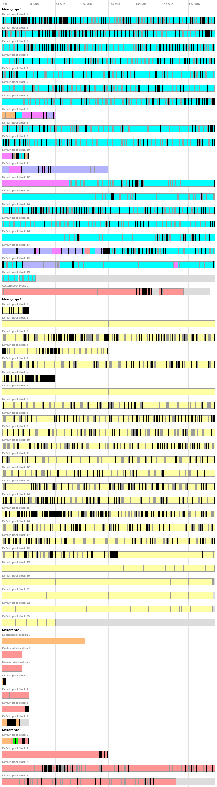

# GpuMemDumpVis

Vulkan/D3D12 Memory Allocator Dump Visualization. 
It is an auxiliary tool that can visualize internal state of [Vulkan Memory Allocator](https://github.com/GPUOpen-LibrariesAndSDKs/VulkanMemoryAllocator) and
[D3D12 Memory Allocator](https://github.com/GPUOpen-LibrariesAndSDKs/D3D12MemoryAllocator) libraries on a picture.
It is a Python script that must be launched from command line with appropriate parameters.

## Requirements

- Python 3 installed
- [Pillow](http://python-pillow.org/) - Python Imaging Library (Fork) installed

## Usage

```
python GpuMemDumpVis.py -o OUTPUT_FILE INPUT_FILE
```

* `INPUT_FILE` - path to source file to be read, containing dump of internal state of the VMA/D3D12MA library in JSON format (encoding: UTF-8/UTF-16), generated using `vmaBuildStatsString()` and `D3D12MA::Allocator::BuildStatsString()` functions.
* `OUTPUT_FILE` - path to destination file to be written that will contain generated image. Image format is automatically recognized based on file extension. List of supported formats can be found [here](http://pillow.readthedocs.io/en/latest/handbook/image-file-formats.html) and includes: BMP, GIF, JPEG, PNG, TGA.

You can also use typical options:

* `-h` - to see help on command line syntax
* `-v` - to see program version number

## Example output



## Legend

*  Light gray without border - a space in Vulkan device memory block unused by any allocation.
*  Buffer with usage containing INDIRECT_BUFFER, VERTEX_BUFFER, or INDEX_BUFFER (Vulkan).
*  Buffer with usage containing STORAGE_BUFFER or STORAGE_TEXEL_BUFFER (Vulkan).
*  Buffer with usage containing UNIFORM_BUFFER or UNIFORM_TEXEL_BUFFER (Vulkan).
*  Other buffer.
*  Image with OPTIMAL tiling and usage containing DEPTH_STENCIL_ATTACHMENT (Vulkan) or a texture with usage containing D3D12_RESOURCE_FLAG_ALLOW_DEPTH_STENCIL (D3D12).
*  Image with OPTIMAL tiling and usage containing INPUT_ATTACHMENT, TRANSIENT_ATTACHMENT, COLOR_ATTACHMENT, or STORAGE (Vulkan), or a texture with usage containing D3D12_RESOURCE_FLAG_ALLOW_RENDER_TARGET or D3D12_RESOURCE_FLAG_ALLOW_UNORDERED_ACCESS (D3D12).
*  Image with OPTIMAL tiling and usage containing SAMPLED (Vulkan) or a texture with usage not containing D3D12_RESOURCE_FLAG_DENY_SHARED_RESOURCE (D3D12).
*  Other image with OPTIMAL tiling (Vulkan) or a texture (D3D12).
*  Image with LINEAR tiling (Vulkan).
*  Image with tiling unknown to the allocator (Vulkan).
*  Allocation of unknown type.
*  Black bar - one or more allocations of any kind too small to be visualized as filled rectangles.

## Additional notes

Warning! Current version of the tool shows incorrect result when allocations alias (overlap) in memory, as it only looks at sizes of the allocations, not their offsets.
