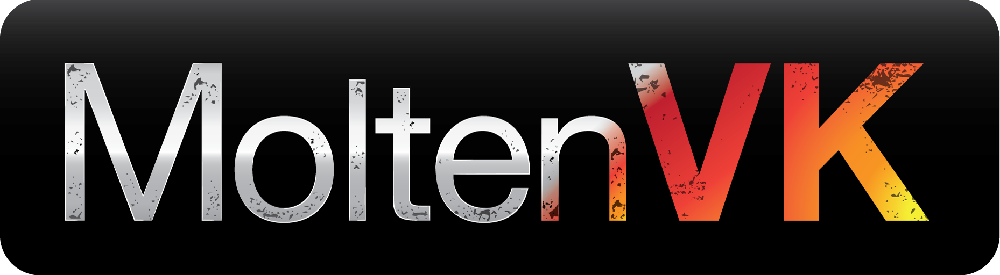

# What's New in MoltenVK

Copyright (c) 2015-2022 [The Brenwill Workshop Ltd.](http://www.brenwill.com)

[comment]: # "This document is written in Markdown (http://en.wikipedia.org/wiki/Markdown) format."
[comment]: # "For best results, use a Markdown reader."

MoltenVK 1.1.11
--------------

Released TBD

- Add support for extensions:
	- `VK_EXT_metal_objects`
	- `VK_KHR_buffer_device_address` and `VK_EXT_buffer_device_address` *(requires GPU Tier 2 argument buffers support)*.
- Reducing redundant state changes to improve command encoding performance.
- Update minimum Xcode deployment targets to macOS 10.13, iOS 11, and tvOS 11,
  to avoid Xcode build warnings in Xcode 14.
- Work around MTLCounterSet crash on additional Intel Iris Plus Graphics drivers.
- Check `MTLDevice` to enable support for `VK_KHR_fragment_shader_barycentric` 
  and `VK_NV_fragment_shader_barycentric` extensions.
- Ignore sampler update in descriptor set bindings that use immutable samplers.
- Fix query pool wait block when query is not encoded to be written to.
- Fix `vkUpdateDescriptorSetWithTemplate()` for inline block descriptors.
- Fix retrieval of accurate `vkGetRefreshCycleDurationGOOGLE()` across multiple display screens.
- Report appropriate values of `VkDebugUtilsMessageTypeFlagsEXT` for debug util messages generated within MoltenVK.
- Update _macOS Cube_ demo to demonstrate optimizing the swapchain across multiple display screens.
- Update `VK_MVK_MOLTENVK_SPEC_VERSION` to version `35`.

MoltenVK 1.1.10
--------------

Released 2022/06/06

- Add support for extensions:
	- `VK_KHR_portability_enumeration` support added to `MoltenVK_icd.json`, and documentation
	  updated to indicate the impact of the `VK_KHR_portability_enumeration` extension during 
	  runtime loading on *macOS* via the *Vulkan Loader*.
	- `VK_KHR_dynamic_rendering`
	- `VK_KHR_fragment_shader_barycentric` and `VK_NV_fragment_shader_barycentric`
	- `VK_KHR_separate_depth_stencil_layouts`
	- `VK_EXT_separate_stencil_usage`
- Implement `vkGetRefreshCycleDurationGOOGLE()` for _macOS_.
- Support attachment clearing when some clearing formats are not specified.
- Fix regression error where previously bound push constants can override a descriptor buffer 
  binding used by a subsequent pipeline that does not use push constants.
- Fix error on some Apple GPU's where a `vkCmdTimestampQuery()` after a renderpass was 
  writing timestamp before renderpass activity was complete.
- Fix regression error in vertex buffer binding counts when establishing implicit buffers binding indexes.
- Fix `vkSetMoltenVKConfigurationMVK()` function pointer typedef.
- Work around zombie memory bug in Intel Iris Plus Graphics driver when repeatedly retrieving GPU counter sets.
- Fix reorder-ctor warnings and add Xcode clang -Wreorder warning to catch future misalignments.
- Update build settings to support Xcode 13.4.
- Update to latest SPIRV-Cross:
	- MSL: Emit interface block members of array length 1 as arrays instead of scalars.
	- MSL: Potentially cast loaded Input variables.
	- Emit KHR barycentrics if source enables the KHR extension.
	- Handle early reads from loop variables with initializers.
	- Attempt more optimal codegen for `OpCompositeInsert`.

MoltenVK 1.1.9
--------------

Released 2022/04/11

- Add support for extensions:
	- `VK_EXT_sample_locations` _(Custom locations settable via_ `vkCmdBeginRenderPass()` _only, 
	   since_ `VkPhysicalDeviceSampleLocationsPropertiesEXT::variableSampleLocations` _is `false`)_.
- Fixes to pipeline layout compatibility between sequentially bound pipelines.
- Reinstate memory barriers on non-Apple GPUs, which were inadvertently disabled in an earlier update.
- Support base vertex instance support in shader conversion.
- Fix alignment between outputs and inputs between shader stages when using nested structures.
- Fix issue where the depth component of a stencil-only renderpass attachment was incorrectly attempting to be stored.
- Fix deletion of GPU counter `MTLFence` while it is being used by `MTLCommandBuffer`.
- Fix crash in `vkGetMTLCommandQueueMVK()`.
- Fix leak of `CoreFoundation` objects during calls to `vkUseIOSurfaceMVK()`.
- Remove limit on `VkPhysicalDeviceLimits::maxSamplerAllocationCount` when not using Metal argument buffers.
- Avoid adjusting SRGB clear color values by half-ULP on GPUs that round float clear colors down.
- Fixes to optimize resource objects retained by descriptors beyond their lifetimes.
- Optimize behavior for `VK_COMMAND_BUFFER_USAGE_ONE_TIME_SUBMIT_BIT` when 
  `MVK_CONFIG_PREFILL_METAL_COMMAND_BUFFERS` is used
- `MoltenVKShaderConverter` tool defaults to the highest MSL version supported on runtime OS.
- Update *glslang* version, to use `python3` in *glslang* scripts, to replace missing `python` on *macOS 12.3*.
- Update `VK_MVK_MOLTENVK_SPEC_VERSION` to version `34`.
- Update to latest SPIRV-Cross:
	- MSL: Support input/output blocks containing nested struct arrays.
	- MSL: Use var name instead of var-type name for flattened interface members.
	- MSL: Handle aliased variable names for resources placed in IB struct.
	- MSL: Handle awkward mix and match of `Offset` / `ArrayStride` in constants.
	- MSL: Append entry point args to local variable names to avoid conflicts.
	- MSL: Consider that `gl_IsHelperInvocation` can be `Volatile`.
	- MSL: Refactor and fix use of quadgroup vs simdgroup.
	- Handle `OpTerminateInvocation`.
	- Fixup names of anonymous inner structs.
	- Fix regression from adding 64-bit switch support.

MoltenVK 1.1.8
--------------

Released 2022/02/22

- Remove logged warning if MoltenVK does not support `VkApplicationInfo::apiVersion` value.

MoltenVK 1.1.7
--------------

Released 2022/02/07

- Add `MVK_HIDE_VULKAN_SYMBOLS` env var to support building MoltenVK with static Vulkan linkage symbols hidden.
- Improve accuracy of `VkPhysicalDeviceLimits::timestampPeriod`.
- Do not use `MTLEvent` for `VkSemaphore` under *Rosetta2*.
- On *Apple Silicon (iOS, tvOS & macOS)*, set `VkPhysicalDeviceProperties::deviceID` from GPU capabilities.
- Support compiling *MSL 2.4* in runtime pipelines and `MoltenVKShaderConverterTool`.
- Fix issue where *MSL 2.3* only available on *Apple Silicon*, even on *macOS*.
- Fix memory leak of dummy `MTLTexture` in render subpasses that use no attachments.
- Fix Metal object retain-release errors in assignment operators.
- Fix use of GPU counter sets on older versions of iOS running on the simulator.
- `mvk::getShaderOutputs()` in `SPRIVReflection.h` support flattening nested structures.
- Replaced ASL logging levels with `MVKConfigLogLevel`.
- `MoltenVKShaderConverter` tool support loading tessellation shader files.
- `MoltenVKShaderConverter` tool update to *MSL 2.4* by default.
- Upgrade to *Vulkan 1.3* headers.
- Update `VK_MVK_MOLTENVK_SPEC_VERSION` to version `33`.
- Update copyright notices to year 2022.
- Update to latest SPIRV-Cross:
	- MSL: Add 64 bit support for `OpSwitch`.
	- MSL: Don't output depth and stencil values with explicit early fragment tests.
	- MSL: Fix incorrect MSL `gl_TessCoord` variable type.
	- MSL: Allow copy array from `UniformConstant` storage.
	- MSL: Handle signed `atomic min/max`.
	- Fix `normalize` on `half3/half2`.
	- MSL: Handle constant construct of block-like array types.
	- MSL: Rethink how opaque descriptors are passed to leaf functions.
	- Rework how loop iteration counts are validated.
	- Clamp vector element access to vector size.
	- Handle aliased names in spec constants.
	- Add support for `LocalSizeId`.

MoltenVK 1.1.6
--------------

Released 2021/11/15

- Set maximum point primitive size based on GPU vendor ID, which can now be as large as `511`.
- Improved checks for timestamp GPU counter support on older devices.
- Fix incorrect validation error on multilayer `VkImage` marked for rendering, when multilayered-rendering 
  is not supported on platform, but app doesn't actually attempt to render to multiple layers.
- Fix dynamic pipeline state such as `vkCmdSetDepthBias()` sometimes ignoring pipeline dynamic 
  state flags when called before `vkCmdBindPipeline()`.
- Fix incorrect validation of multilayer-rendering validation when `MVKImageView` 
  does not actually perform multilayer-rendering.
- Fix issue where dynamic pipeline flags were sometimes read from previously bound pipeline.
- Fix issue where correct base layer and mipmap for attachment was sometimes not being used.
- Add `MTLFence` between Metal encoders and timestamp stage counter BLIT encoder 
  to ensure previous work is finished before being timestamped.
- Fix issue with `BC1_RGB` compressed format where incorrect alpha value returned.
- Add `vkGetMTLCommandQueueMVK()` function to expose underlying `MTLCommandQueue` object.
- Add `vkSetWorkgroupSizeMVK()` function.
- Add unsupported `VkApplicationInfo::apiVersion` warning.
- Update to latest SPIRV-Cross version:
	- MSL: Add support for `OpSpecConstantOp` ops `OpQuantizeToF16` and `OpSRem`.
	- MSL: Return fragment function value even when last SPIR-V Op is discard (`OpKill`).
	- MSL: Fix location and component variable matching between shader stages.
	- MSL: Fix type redirection when struct members are reordered to align with offsets.
	- MSL: Remove over-zealous check for struct packing compatibility.
	- MSL: Correctly emit user(`clip/cullN`) for clip/cull builtins in tess output struct.
	- MSL: Don't output depth and stencil values with explicit early fragment tests.
	- MSL: Track location component to match `vecsize` between shader stages.
	- MSL: Selectively enable `fast-math` in MSL code to match Vulkan CTS results.
	- MSL: Honor `DecorationNoContraction` when compiling using `fast-math`.
	- MSL: Honor infinities in `OpQuantizeToF16` when compiling using `fast-math`.
	- MSL: Support synthetic functions in function constants.
	- MSL: Improve handling of `INT_MIN/INT64_MIN` literals.
	- MSL: Consolidate `spvQuantizeToF16()` functions into a single template function.
	- MSL: Use `vec<T, n>` in template `SpvHalfTypeSelector` for function `spvQuantizeToF16()`.
	- MSL: Support more usecases for unpacked vectors.
	- MSL: Workaround compiler crashes when using `threadgroup bool`.
	- MSL: Handle non-thread storage class in `Modf/Frexp` pointer versions.
	- Improve handling of `INT_MIN/INT64_MIN` literals.
	- Per spec, support undefined behavior for out-of-bounds swizzles.
	- Correctly reflect declared buffer size for out of order members.
	- Separate (partially) the tracking of depth images from depth compare ops.

MoltenVK 1.1.5
--------------

Released 2021/08/30

- Changes to how `VkSemaphore` is supported:
	- Revert to prefer `MTLEvent` for `VkSemaphore`, except on NVIDIA, where emulation on CPU is preferred.
	- Set default value of the `MVK_ALLOW_METAL_FENCES` environment variable to `0 (false)`,
- Vulkan timestamp query pools use Metal GPU counters when available.
- Support resolving attachments with formats that Metal does not natively resolve.
- Support stencil-only partial attachment clearing.
- Support alpha-to-coverage without a color attachment.
- Fix issue where swapchain images were acquired out of order under heavy load.
- Fix issue with `vkCmdBlitImage()` from compressed textures.
- Fix incorrect translation of clear color values on Apple Silicon.
- Fix swizzle of depth and stencil values into RGBA (`float4`) variable in shaders.
- Fix occasional crash when swizzling used but shader swizzling not enabled.
- Fix pipeline barriers not working inside self-dependent subpasses on Apple GPUs.
- Fix GPU race condition when clearing a renderpass input attachment on Apple GPUs.
- Disable `VK_FORMAT_FEATURE_COLOR_ATTACHMENT_BLEND_BIT` for 
  `VK_FORMAT_E5B9G9R9_UFLOAT_PACK32` on macOS Apple Silicon.
- Fix execution order of `encodeBindings` for `bufferBindings`.
- Properly ignore non-null pipeline creation pointers that should be ignored.
- Add queue and queue family indices to `MTLCommandBuffer` label.
- Update `VK_MVK_MOLTENVK_SPEC_VERSION` to `32`.
- Update to latest SPIRV-Cross version:
	- MSL: Adjust `gl_SampleMaskIn` for sample-shading and/or fixed sample mask.
	- MSL: Remove redundant path for `SampleMask`.
	- MSL: Fix setting `SPIRVCrossDecorationInterpolantComponentExpr` decoration.
	- MSL: Support row-major transpose when storing matrix from constant RHS matrix.
	- MSL: Fix casting in constant expressions with different sizes.
	- MSL: Fix duplicate `gl_Position` outputs when `gl_Position` defined but unused.
	- MSL: Simplify `spvSubgroupBallot()`.
	- MSL: Consider that function/private variables can be block-like.
	- Track temporary access for `OpArrayLength` result.

MoltenVK 1.1.4
--------------

Released 2021/06/28

- Add support for extensions:
	- `VK_KHR_imageless_framebuffer`
- Advertise Vulkan extension functions only from enabled extensions.
- Make `vkGetPastPresentationTimingGOOGLE()` queuing behavior compliant with Vulkan spec.
- Expose `vkGetIOSurfaceMVK()` and `vkUseIOSurfaceMVK()` without requiring _Objective-C_.
- Default MoltenVK build using `C++17` and compiler optimization setting `-O2`.
- API fix to remove `#include "SPIRVReflection.h"` from `SPIRVToMSLConverter.h` header.
- Support _Xcode 12.5_ build settings, build warnings, and SDK change to availability of
  `[MTLDevice supportsBCTextureCompression]` on _Mac Catalyst_.
- Add support for new AMD devices supporting 32 lanes.
- Improve handling of sampler border color and mirror edge clamp.
- Improve cache hits when matching `SPIRVToMSLConversionConfiguration` structs to each other 
  to find a cached shader, by only considering resources from the current shader stage.
- Rename `kMVKShaderStageMax` to `kMVKShaderStageCount`.
- Fix crash when requesting `MTLCommandBuffer` logs in runtime debug mode on older OS versions.
- Fix synchronization issue with locking `MTLArgumentEncoder` for Metal Argument Buffers.
- Fix race condition on submission fence during device loss.
- Fix crash due to incorrect number of attachments when clearing.
- Fix crash using memoryless storage for input attachments on Apple Silicon.
- Fix issue where M1 GPU does not support reusing Metal visibility buffer offsets
  across separate render encoders within a single Metal command buffer (Vulkan submit).
- On command buffer submission failure, if `MVKConfiguration::resumeLostDevice` enabled,  do not release 
  waits on `VkDevice`, and do not return `VK_ERROR_DEVICE_LOST`, unless `VkPhysicalDevice` is also lost.
- Fix inconsistent handling of linear attachment decisions on Apple Silicon.
- Fix small memory leak during swapchain creation.
- Fix stencil clear incorrectly using using the depth `loadOp`,  when stencil is smaller than render area.
- Reorganize coherent texture flushing on memory map and unmap`.
- Fix issues where data in temporary internal buffers are discarded while in use.
- Protect against crash when retrieving `MTLTexture` when `VkImage` has no `VkDeviceMemory` bound.
- Adjust some `VkPhysicalDeviceLimits` values for Vulkan and Metal compliance. 
- Fix internal reference from `SPIRV_CROSS_NAMESPACE_OVERRIDE` to `SPIRV_CROSS_NAMESPACE`.
- Add label strings to `MTLCommandBuffers`, based on use type, for GPU Capture debugging.
- Add `Scripts/runcts` script as a convenience for running Vulkan CTS tests.
- Support _Xcode 13_ SDK APIs and build settings.
- Update dependency libraries to match _Vulkan SDK 1.2.182_.
- Update to latest SPIRV-Cross version:
	- MSL: Handle array of IO variable with Component decoration.
	- MSL: Handle array with component when we cannot rely on `user()` attrib.
	- MSL: Improve handling of split tessellation access chains.
	- MSL: Always enable support for base vertex/index on _iOS_.

MoltenVK 1.1.3
--------------

Released 2021/04/27

- Add beta support for using Metal argument buffers for shader resources on _macOS_, by setting 
  `MVK_CONFIG_USE_METAL_ARGUMENT_BUFFERS` environment variable (disabled by default). This dramatically
  expands the number of resources that can be submitted to a pipeline stage, per the Vulkan
  `VK_EXT_descriptor_indexing` extension. **Currently available on _macOS 11.0 (Big Sur)_ or later, 
  and on earlier _macOS_ versions on _Intel_ GPU's**.
- Add support for `HDR10` colorspace via `VK_COLOR_SPACE_HDR10_HLG_EXT` and `VK_COLOR_SPACE_HDR10_ST2084_EXT`.
- Always explicitly set `CAMetalLayer` colorspace property based on _Vulkan_ parameters, 
  and don't rely on _Metal_ default values.
- Add `MVKConfiguration::resumeLostDevice` and `MVK_CONFIG_RESUME_LOST_DEVICE` env var,
  to allow `VkDevice` to resume after non-fatal `VK_ERROR_DEVICE_LOST` error.
- `MVKDescriptorPool` pools its descriptor sets.
- Enable `MVKConfiguration::preallocateDescriptors` and `MVK_CONFIG_PREALLOCATE_DESCRIPTORS` 
  environment variable by default to preallocate descriptors when a `VkDescriptorPool` is created.
- Avoid use of _Metal_ renderpass load and store actions on memoryless attachments.
- Fix memory leak on swapchain destruction.
- Fix `MVKPhysicalDevice::getSurfaceFormats()` returning `VK_FORMAT_UNDEFINED`.
- Fix memory leak where swapchains and images were not destroyed due to a retention loop.
- Fix advertising single-texel alignment capability for texel buffers.
- Fix time and space inefficiencies caused by missed shader cache lookup hits in `MVKShaderLibraryCache`.
- Log enhanced command buffer errors in debug mode.
- Ensure queue submission message logging occurs before submission object is destroyed.
- Remove project qualifiers from references to `SPIRV-Cross` header files.
- Only perform automatic GPU capture on queue identified by `MVKConfiguration::defaultGPUCaptureScopeQueueIndex` 
  and `defaultGPUCaptureScopeQueueFamilyIndex`.
- Introduce `MVKConfigLogLevelBits`, `MVKConfigAutoGPUCaptureScopeBits`, and `MVKConfigTraceVulkanCallsBits` 
  enums to specify config API  values in a Vulkan-friendly manner, while automatically documenting the same values for env vars.
- Add `MVKConfiguration::apiVersionToAdvertise` and `MVK_CONFIG_API_VERSION_TO_ADVERTISE` 
  env var to configure **MoltenVK** to advertise a particular _Vulkan_ version.
- Add `MVKConfiguration::advertiseExtensions` and `MVK_CONFIG_ADVERTISE_EXTENSIONS` 
  env var to configure **MoltenVK** to force advertising support for no, or minimally few, _Vulkan_  extensions.
- Remove the `Hologram` and `API-Samples` demo apps, and remove 
  `LunarG/VulkanSamples` as a dependency library.
- Add `NDEBUG` macro to all Release builds to remove `assert()` calls.
- Update `VK_MVK_MOLTENVK_SPEC_VERSION` to `31`.
- Update dependency libraries to match _Vulkan SDK 1.2.176_.
- Update to latest SPIRV-Cross version:
	- MSL: Support long `ulong` types in buffers in 2.3+.
	- MSL: Support padding Metal argument buffer entries based on argument index.
	- Add interfaces to aid with LTO-style optimization
	- Handle edge cases in `OpCopyMemory`.

MoltenVK 1.1.2
--------------

Released 2021/02/22

- Advertise support for `shaderInt64` feature.
- Support fast math on MSL compiler via `MVKConfiguration::fastMathEnabled` configuration 
  setting and `MVK_CONFIG_FAST_MATH_ENABLED` environment variable (enabled by default).
- Support compiling MSL with position invariance if indicated in SPIRV shader.
- `vkGetMoltenVKConfigurationMVK()` and `vkSetMoltenVKConfigurationMVK()` functions
  can now be used with a `VkInstance` from another Vulkan layer, or with a `VK_NULL_HANDLE VkInstance`.
- `MVKConfiguration` extended to cover all MoltenVK environment variables.
- Report accurate value of 8 for `VkPhysicalDeviceLimits::maxBoundDescriptorSets`.
- Advertise macOS M1 GPU as `VK_PHYSICAL_DEVICE_TYPE_INTEGRATED_GPU`.
- For Vulkan semaphores, prefer using `MTLFence` over `MTLEvent`.
- Support `immmutableSamplers` with sampler arrays.
- Query pools write to dedicated temporary internal buffer to span multiple render passes 
  and support larger query counts.
- Fixes for race conditions in CTS multithread tests, guarding `MTLDevice` on cross-thread syncing.
- Set Metal buffer alignment to 256 on non-Apple Silicon iOS/tvOS simulators.
- `MVKMTLBufferAllocation`: Support device-local temp buffers for tessellation, 
  indirect multiview, or occlusion queries buffer usage.
- `MVKPixelFormats`: Enable `RenderTarget` usage for linear textures on Apple GPUs.
- `MVKRenderPass`: Use a non-trivial granularity for TBDR GPUs.
- Don't use barriers in render passes on Apple GPUs.
- `MVKGraphicsPipeline`: Fix color write mask with `RGB9E5` RTs.
- `MVKImagePlane`: When sync'ing, create the texture if it doesn't exist.
- `MVKRenderPass`: Don't use `Load/Store` actions for memoryless.
- `MVKRenderPass`: Only use `MTLStorageModeMemoryless` where available.
- `MVKDeviceMemory`: Don't consider Memoryless host-accessible on *macOS/tvOS*.
- `MVKCmdResolveImage` fix incorrectly changing first resolve layer's src/dst base layer.
- `MVKPhysicalDevice`: Require Mac family 2 for render without attachments.
- `MVKPhysicalDevice`: Disable SIMD-group permutation for Mac family 1.
- `MVKPhysicalDevice`: Clamp maximum buffer range to 4 GiB - 1.
- `MVKMTLBufferAllocation`: Mark temp buffers as volatile.
- `SPIRVReflection`: Multiple entry point support for `getShaderOutputs()`.
- Remove obsolete `MVKVector`, which was long ago replaced with `MVKSmallVector`.
- Remove official support for submitting shaders directly containing MSL source code or compiled MSL code.
  MSL shaders may still be directly submitted, and may work, but it is not officially supported at this time.
  Future versions of **MoltenVK** may support direct MSL submission again.
- Remove `ONLY_ACTIVE_ARCH` from Debug builds. **MoltenVK _Debug_** builds now build for all platform architectures.
- Add ability to automatically capture first GPU frame by setting `MVKConfiguration::autoGPUCaptureScope`
  (or environment variable `MVK_CONFIG_AUTO_GPU_CAPTURE_SCOPE`) to `2`.
- Support _GitHub Actions_ for CI builds on pull requests.
- Support pre-built binary artifacts from _GitHub Actions_ CI builds.
- `Makefile` and `fetchDependencies` support `xcpretty`, if available.
- Remove support for _Travis-CI_.
- Update `VK_MVK_MOLTENVK_SPEC_VERSION` to `30`.
- Update copyright notices to year 2021.
- Update Xcode build settings check to _Xcode 12.4_.
- Support legacy building on _Xcode 11.7_.
- Update dependency libraries to match *Vulkan SDK 1.2.170*.
- Update to latest SPIRV-Cross version:
	- MSL: Gracefully assign automatic input locations to builtin attributes.
	- MSL: Refactor out location consumption count computation.
	- MSL: Always return `[[position]]` when required.
	- MSL: Fix some edge cases in input attachment handling.
	- MSL: Fix various bugs with framebuffer fetch on macOS and argument buffers.
	- MSL: Always use input_attachment_index for framebuffer fetch binding.
	- MSL: Make sure initialized output builtins are considered active.
	- MSL: Always enable Outputs in vertex stages.
	- MSL: Only consider builtin variables and flatten builtin arrays if they are part of IO interface.
	- MSL: Handle load and store to TessLevel array in TESC.
	- MSL: Fixup type when using tessellation levels in TESC functions.
	- MSL: Fix automatic assign of builtin attributes in tessellation.
	- GLSL/MSL: Handle more complicated tessellation Output initializers.
	- MSL: Emit correct initializer for tessellation control points.
	- MSL: Handle initializers for tess levels.
	- MSL: Fix initializer for tess level outputs.
	- MSL: Fix broken reserved identifier handling for entry points.
	- MSL: Handle reserved identifiers for entry point.
	- Fix pathological complexity explosion for certain shaders.
	- Improve handling of complex variable initialization.
	- Expose position invariance.

MoltenVK 1.1.1
--------------

Released 2020/12/09

- Add support for extensions:
	- `VK_KHR_sampler_mirror_clamp_to_edge` (iOS)
	- `VK_KHR_timeline_semaphore`
	- `VK_EXT_descriptor_indexing` (initial release limited to Metal Tier 1: 96/128 textures, 16 samplers)
	- `VK_EXT_post_depth_coverage` (macOS)
	- `VK_EXT_private_data`
	- `VK_EXT_subgroup_size_control`
	- `VK_EXT_texture_compression_astc_hdr`
	- `VK_AMD_shader_image_load_store` (macOS)
	- `VK_IMG_format_pvrtc` (macOS)
- Support the *Mac Catalyst* platform for *iOS* apps on *macOS 11.0+*, 
  under both `x86_64` and `arm64` architectures.
- Re-enable `MTLEvent`-based semaphores and fix several `MVKSync` issues.
- Use `VK_KHR_image_format_list` to disable `MTLTextureUsagePixelFormatView`
  if only swizzles or `sRGB` conversion will be used for image views, improving 
  performance on *iOS* by allowing Metal to use lossless texture compression.
- Handle device loss.
- Fix crash in `vkUpdateDescriptorSets()` when copying inline block descriptors.
- Fix Metal validation error when unused elements in an array of sampler are not populated by descriptors.
- Fix crashes in `vkUseIOSurfaceMVK()` on chroma sampling and double releasing of`MTLTexture`.
- Fix potential drawable present race conditions.
- Fix crash in `vkUpdateDescriptorSets()` when copying inline block descriptors.
- Fix Metal validation error when unused elements in an array of sampler are not populated by descriptors.
- Move *Metal* drawable presentation from `MTLCommandBuffer` to `MTLDrawable`
  to improve performance and reduce blocking.
- Allow binding descriptor set using layout different than it was created with.
- Report `VkPhysicalDeviceLimits::maxPerStageDescriptorStorageImages` as Metal limit of `8`.
- Increase per-stage texture count to `96` for A11 SoC's and above.
- Use variable descriptor count when determining descriptor binding count.
- Support setting sizes of SPIR-V unsized arrays.
- Support `MTLStorageTypeMemoryless` for Apple Silicon on Mac.
- Support Apple GPU pixel formats with Apple Silicon on Mac.
- Allow linear images on Apple GPUs in Blit and Clear commands.
- Apple family 7 GPUs (A14) on iOS support multisample layered rendering, 
  as well as sampler border colors and the mirror clamp to edge sampler address mode.
- Set fill mode, depth bias, viewport, and scissor states before clearing attachments
- Disable culling for the duration of `vkCmdClearAttachments()`
- `MVKDevice` increase minimum OS for shared-storage textures.
- `MVKDevice` set properties for Apple Silicon GPUs on macOS.
- `MVKQueue` only create one `GPUCaptureScope` per queue.
- `MVKSamplerYcbcrConversion` always make sure there is one plane.
- `MVKPhysicalDevice` correct fragment input component limit.
- `MVKPhysicalDevice` set max visibility buffer size to 256 kiB where supported.
- `MVKPhysicalDevice` expose support for interpolation functions.
- `MVKPhysicalDevice` enable 3D compressed textures on *iOS/tvOS*, and forbid ETC2 and EAC 
   3D textures on all platforms. Apple GPUs do not support 3D for those.
- `MVKPhysicalDevice` enable Apple family 7 features on *iOS*.
- `MVKPhysicalDevice` remove need to call `initGPUInfoProperties()` twice.
- `MVKPhysicalDevice` correct max descriptor set resources.
- `MVKPhysicalDevice` reduce maximum point size to 64.
- `MVKPhysicalDevice` enable strictLines for Intel and NVIDIA.
- `MVKPhysicalDevice` enable `shaderResourceMinLod` on *iOS*.
- `MVKPhysicalDevice` set correct subgroup properties.
- `MVKPhysicalDevice` enable texture swizzle on all Apple GPUs.
- `MVKPipelineLayout` only set configuration result if validating.
- `MVKPipeline` fix calculation of atomic image buffer addresses.
- `MVKPipeline` disable rasterization if culling both sides and don't try to add a fragment shader.
- `MVKPipeline` shorten vertex attribute format's length when `stride` < `size`.
- `MVKGraphicsPipeline` handle `minSampleShading`.
- `MVKImage` always use texel buffers for linear images in `MTLHeaps`.
- `MVKImage` make sure plane heap offsets are properly aligned.
- `MVKImage` always set the depth plane when rendering to a 3D image.
- `MVKImage` avoid swizzling storage and/or attachment image views.
- `MVKImage` avoid texel buffer for atomics if view format list
    exists and does not include either `R32_UINT` or `R32_SINT` format.
- `MVKImageView` always ignore transfer usages.
- `MVKBufferView` avoid triggering `bytesPerRow` validation warning.
- `MVKDescriptorSetLayout` speed up lookup of descriptor index and streamline binding access.
- `MVKCmdBlitImage` use layered draws when possible.
- `MVKCmdBlitImage` add 0.5 to layer index before interpolating.
- `MVKCmdBlitImage` support depth/stencil blits with inversion and scaling.
- `MVKSwapchain`  allow images whose size doesn't match the `CAMetalLayer`.
- `MVKPixelFormats` add 0.5 ULP to clear values for normalized formats.
- `MVKCommandEncoder` don't set `renderTargetArrayLength` for mixed 2D/3D renders.
- `MVKExtensions` add missing *tvOS* case for unsupported extensions.
- `MVKDescriptorSetLayout` sort and hold bindings by binding number.
- `MVKDescriptor` simplify subclass implementations.
- `MVKComputePipeline` override max threads per threadgroup.
- `MVKGPUCapture` make sure the `MTLCaptureScope` has only one reference.
- `MoltenShaderConverter` fix *tvOS* build to support *tvOS 9.0*.
- Support building external libraries and dylibs against sanitizers.
- Clarify documentation on mapping limitations for host-coherent image memory on *macOS*.
- Add validation policy for MoltenVK development to `README.md` document.
- Update Xcode build settings check to Xcode 12.2.
- Update `VK_MVK_MOLTENVK_SPEC_VERSION` to `29`.
- Update dependency libraries to match *Vulkan SDK 1.2.162*.
- Update to latest SPIRV-Cross version:
	- MSL: Support `SPV_EXT_demote_to_helper_invocation` for MSL 2.3.
	- MSL: Support run-time sized image and sampler arrays
        (`GL_EXT_nonuniform_qualifier/SPV_EXT_descriptor_indexing`).
	- MSL: Support atomic access to images from argument buffers.
	- MSL: Add missing interlock handling to atomic image buffers.
	- MSL: Fix calculation of atomic image buffer address.
	- MSL: Support querying and modifying generated combined sampler suffix.
	- MSL: Don't use a bitcast for tessellation levels in tesc shaders.
	- MSL: Handle Offset and Grad operands for 1D-as-2D textures.
	- MSL: Don't remove periods from swizzle buffer index exprs.
	- MSL: Correct definitions of subgroup ballot mask variables.
	- MSL: Extract global variables from subgroup ballot operations.
	- MSL: Mask ballots passed to ballot bit ops.
	- MSL: Don't mask off inactive bits in ballot masks.
	- MSL: Support vectors with `OpGroupNonUniformAllEqual`.
	- MSL: Cast broadcast booleans to `ushort`.
	- MSL: Do not use `component::x` gather for `depth2d` textures.
	- MSL: For 2.1+, don't disable rasterization for vertex writes.
	- MSL: Allow post-depth coverage on Mac in MSL 2.3.
	- MSL: Allow framebuffer fetch on Mac in MSL 2.3.
	- MSL: Allow Bias and Grad arguments with comparison on Mac in MSL 2.3.
	- MSL: Support pull-model interpolation on MSL 2.3+
	- MSL: Expand subgroup support.
	- MSL: Adjust `FragCoord` for sample-rate shading.
	- MSL: Expose some more features on iOS: `min_lod_clamp()`, `simd_is_helper_thread()`,
	    `barycentric_coord`, and `primitive_id`.
	- MSL: Don't add fixup hooks for builtin variables if they're unused.
	- MSL: Don't try to use `[[thread_index_in_simdgroup]]` in vertex shaders.
	- Handle case where block is loop header, continue AND break block.
	- MSL: Added `fmin3` and `fmax3` library functions to the illegal name list.
	- Added Metal keyword: `level`.
	- Parser: Don't assume `OpTypePointer` will always take a `SPIRType`.
	- Add MIT dual license for the SPIRV-Cross API and CLI.

MoltenVK 1.1.0
--------------

Released 2020/09/28

>**_Note:_** This release contains changes to library paths and framework linking options.

- Add support for Vulkan 1.1, including:
	- The `vkEnumerateInstanceVersion()` function
	- The `vkGetDeviceQueue2()` function
	- Protected memory (non-functional)
	- A feature struct for `VK_KHR_shader_draw_parameters`
	- All extensions that were promoted to core in Vulkan 1.1
- Add support for extensions:
	- `VK_KHR_portability_subset`
	- `VK_KHR_create_renderpass2`
	- `VK_KHR_depth_stencil_resolve`
	- `VK_KHR_external_fence` (non-functional groundwork for future extensions,
	  including support for GCD and Mach semaphores)
	- `VK_KHR_external_fence_capabilities` (non-functional groundwork for future
	  extensions, including support for GCD and Mach semaphores)
	- `VK_KHR_external_semaphore` (non-functional groundwork for future
	  `MTLSharedEvent` Vulkan extension)
	- `VK_KHR_external_semaphore_capabilities` (non-functional groundwork for
	  future `MTLSharedEvent` Vulkan extension)
	- `VK_KHR_multiview`
	- `VK_KHR_shader_subgroup_extended_types`
- Remove support for obsolete `VK_EXTX_portability_subset` extension.
- Redesign build and linking options that leverage newer framework technology:
	- Add comprehensive support for multi-platform, multi-architecture `XCFrameworks`.
	- Build fat single-platform, multi-architecture `dylibs`.
	- Add support for *Apple Silicon* builds for *macOS* and *Simulators*.
	- Remove support for distinct legacy frameworks and static libraries.
	- Remove support for fat libraries and frameworks that span device and simulators.
	- Combine `MoltenVKSPIRVToMSLConverter` and `MoltenVKGLSLToSPIRVConverter` frameworks 
	  into a single `MoltenVKShaderConverter` framework.
- Support copying between 3D and 2D images.
- Support clearing 3D images.
- Support linear images and buffer views in shared memory on *macOS 10.15.5+*.
- Support `VK_IMAGE_CREATE_EXTENDED_USAGE_BIT`.
- Support multiple aliased images for dedicated image memory allocations.
- Improve performance of tessellation control pipeline stage by processing multiple 
  patches per workgroup.
- `vkCmdBindDescriptorSets` order `pDynamicOffsets` by descriptor binding number 
  within each descriptor set.
- `vkCmdCopyImage` on macOS flush non-coherent image memory before copy operation.
- Process multiple patches per workgroup in a tessellation control shader.
- Initialize tessellation related variables conditionally in indirect draws.
- Fix build errors on Simulator not supporting `MTLDrawable` present time options.
- Fix `dynamicOffsets` ordering based on binding index.
- Ensure the base texture is created when creating a view texture.
- Fix features, alignment, and image properties of chroma subsampled formats.
- Disable `variableMultisampleRate` feature.
- Permit renderpass to have no attachments.
- Clear linear images using a compute shader.
- Reject attempts to create compressed linear images.
- Always use a texel buffer for atomic linear storage images.
- Use deferred store actions instead of tracking multi-pass draws.
- Use `MTLRenderPassDescriptor renderTargetWidth` and `renderTargetHeight` on macOS 10.15 and newer.
- Use a 2D non-arrayed view for 2D non-arrayed attachments.
- Use arrayed textures for layered subpass input.
- Use layered rendering when clearing or resolving images whenever possible,
  and take `renderArea` into account.
- Streamline image copying when the entire source is being copied to the entire destination.
- Don't set `renderTargetArrayLength` on devices that don't support it.
- Don't attempt to clear unused attachments and fix vertex count for clearing multiple layers.
- Don't encode commands that draw zero vertices.
- Ignore `addressModeW`  on samplers with unnormalized coordinates.
- Flip GPU when swapchain is created, not when device object is created,
  to optimize this condition if it is not needed.
- Flush source image of a transfer on *macOS*.
- Fix offset for texel buffers and heaps for multi-planar images.
- Fix memory leak when object create fails.
- Fix several use-after-freed errors.
- Fix applying divisors to instanced vertex attributes.
- Fix issue in accessing `MTLTexture` for swapchain image planes.
- Fix occasional crash on vertex stage indirect draws.
- Fix reported image format properties for 1D images as 2D.
- `VK_EXT_vertex_attribute_divisor` fix issues with zero divisors.
- Re-add support for bitcode generation on *iOS* and *tvOS*.
- `fetchDependencies` builds serially by default for better build script integration. 
- Combine `MoltenVKSPIRVToMSLConverter` and `MoltenVKGLSLToSPIRVConverter` 
  frameworks into a single `MoltenVKShaderConverter` framework.
- Fix Metal validation error when occlusion query and renderpass are in separate 
  Vulkan command buffers.
- Fix a crash on starting a query outside a render pass.
- Fix Metal validation error that forbids rendering to an image of zero size.
- Fix issue where descriptor pool releasing descriptor sets it doesn't own.
- Fix issue where load/store actions not set in renderpass that includes compute stage.
- Prevent accidental `setColorStoreAction` for non-color attachments.
- Fix image copy destination extent of compressed images.
- Fix image resolve sub-region extent.
- Fix owner of merged `MVKShaderLibraries`.
- Fix rounding of buffer sizing when `VK_WHOLE_SIZE` is used.
- Fix detection of indexed draw calls.
- `vkSetMTLTextureMVK()` Fix crash if incoming `MTLTexture` does not have an associated `IOSurface`. 
- Update dependency libraries to match *Vulkan SDK 1.2.154*.
- Update to latest SPIRV-Cross version:
	- MSL: Fix handling of matrices and structs in the output control point array.
	- MSL: Enclose args when convert `distance(a,b)` to `abs(a-b)`.
	- MSL: Fix multiview view index calculation with a non-zero base instance.
	- MSL: Don't set the layer for multiview if the device doesn't support it.
	- MSL: Fix `OpCompositeInsert` and `OpVectorInsertDynamic`.
	- MSL: Support layered input attachments.
	- Ensure that we use primary alias type when emitting flattened members.
	- Only rewrite type aliases for the base type.
	- Overhaul how we deal with reserved identifiers.
	- Implement a simple evaluator of specialization constants.
	- Deal with case where a selection construct conditionally merges/breaks.
	- Allow `flip_vert_y` in all relevant stages.
	- Clean up conditional branch codegen.

MoltenVK 1.0.44
---------------

Released 2020/07/28

- Add support for extensions:
	- `VK_KHR_driver_properties`
	- `VK_KHR_sampler_ycbcr_conversion`
	- `VK_EXT_image_robustness`
	- `VK_EXT_robustness2`
- Add native support for `VK_FORMAT_D16_UNORM` on **_iOS 13.0+_** and **_tvOS 13.0+_**.
- Add support for **_tvOS_** platform.
- Add support for **_iOS Simulator_** and **_tvOS Simulator_** build destinations.
- Cube demo runs on **_tvOS_**, **_iOS Simulator_**, and **_tvOS Simulator_**.
- **_MoltenVK_** Xcode schemes support building fat *Platform+Simulator* binaries.
- `Makefile` supports building fat *Platform+Simulator* binaries, plus *Debug* builds.
- `fetchDependencies` script supports platform build selection, plus parallel builds.
- `vkCmdBlitImage()` returns error if scaling or inverting to linear image on *macOS*.
- Support `VK_FORMAT_A2B10G10R10_UNORM_PACK32` as a surface format.
- Support `VkPipelineMultisampleStateCreateInfo::pSampleMask`.
- Support `VkPhysicalDeviceSubgroupProperties`.
- Fix memory layout of inline uniform blocks.
- Fix issue where mapped host-coherent device memory not updated from image contents on *macOS*.
- Fix image memory sizing and offsets.
- Fix small memory leak when setting swapchain color space.
- Fix new and unexpected App Store failure on newly deprecated color space values.
- Fix intermittent concurrent shader specialization race condition.
- Fix offsets when flushing buffer data to GPU.
- Fix issue where expected buffer-sizes buffer not bound to Metal compute encoder.
- Ensure fragment shader inputs to have as many components as vertex shader outputs.
- Include vertex attribute size when testing whether attribute offset exceeds stride.
- Add support for `USCALED/SSCALED` vertex formats.
- Add host-coherent texel buffer caching just for buffer views.
- Include MoltenVK Git revision hash in `VkPhysicalDeviceProperties::pipelineCacheUUID`.
- Add `MVKPhysicalDeviceMetalFeatures::vertexStrideAlignment` to track Metal vertex binding stride alignment.
- Add `MVKPhysicalDeviceMetalFeatures::indirectTessellationDrawing` to track if indirect tessellation drawing is supported.
- Remove use of `@available()` directive as it was causing issues in some build environments.
- Pass pipeline sample mask, if present, to SPIRV-Cross.
- Refactor **MoltenVK** *Xcode* build architectures.
- Demo `API-Samples generateSPIRVShaders` no longer builds `MoltenVKShaderController` tool.
- Update `VK_MVK_MOLTENVK_SPEC_VERSION` to `27`.
- Update dependency libraries to match *Vulkan SDK 1.2.148*.
- Update to latest SPIRV-Cross version:
	- MSL: Add support for processing more than one patch per workgroup.
	- MSL: Workaround broken scalar access chain behavior in MSL LLVM IR / AIR.
	- MSL: Do not emit swizzled writes in packing fixups.
	- MSL: Ensure `OpStore` source operands are marked for inclusion in function arguments.
	- MSL: Enabling setting an additional fixed `sampleMask` in fragment shaders.
	- MSL: Remove obsolete `MSLVertexAttr` and `MSLShaderInput` members.
	- MSL: Fix up input variables' vector lengths in all stages.
	- MSL: Improve handling of array types in buffer objects.
	- MSL: Deal with loading non-value-type arrays.
	- MSL: Deal with array load-store in buffer-block structs.
	- MSL: Use input attachment index directly for resource index fallback.
	- Fix missing switch cases in `Y'CbCr` conversion.
	- Implement context-sensitive expression read tracking.

MoltenVK 1.0.43
---------------

Released 2020/06/09

- Fix issue in reporting properties of substitutable `VkFormats`.
- Fix vertex attribute offset adjustments when vertex buffer stride is zero.
- Update `fetchDependencies` script to use pre-built `spirv-tools` files by default.
- Update `maxVertexInputBindingStride` and `maxVertexInputAttributeOffset` 
  to minimum Vulkan values.
- Numerous documentation typo corrections.
- Update `VK_MVK_MOLTENVK_SPEC_VERSION` to `26`.
- Update Travis CI to Xcode 11.5.

MoltenVK 1.0.42
---------------

Released 2020/06/01

- Add support for extensions:
	- `VK_GOOGLE_display_timing`
	- `VK_KHR_external_memory` (non-functional groundwork for future 
	  Metal-resource Vulkan extension).
	- `VK_KHR_external_memory_capabilities` (non-functional groundwork 
	   for future Metal-resource Vulkan extension).
- Memory consumption improvements in command handling and vector pre-allocation optimizations.
- `vkQueuePresentKHR()` returns a `VkResult` for each swapchain.
- `MVKPipeline` disable fragment shader outputs for unused attachments.
- `MVKBuffer` support texel buffers in host-coherent memory on Mac.
- `MVKDescriptor` pass buffers to shaders that do atomic image accesses.
- Support vertex attribute offsets larger than the vertex buffer stride.
- Fix crash when more than two GPUs.
- Fix issue where `vkGetPhysicalDeviceFormatProperties()` incorrectly returned 
  properties for unsupported formats.
- Fix stack overflow in when logging and reporting very long messages.
- Fix situation where compute pipeline state not retained across copy and renderpass operations.
- Fix buffer offset calculation.
- Fixes to maximum FPS calculations.
- Fix buffer size passed to shaders when `VkDescriptorBufferInfo.range` set to `VK_WHOLE_SIZE`.
- Update maximum number of framebuffer layers to 2048.
- Support stencil only image formats in identity swizzle case.
- Enables format atomic capabilities only when format supports it.
- Add `MVKSmallVector` as a more memory efficient substitute of `MVKVector`.
- Reinstate `VulkanSamples API-Samples` demo apps and add 
  `input_attachment` and `push_descriptors` demos.
- Add `MVK_CONFIG_AUTO_GPU_CAPTURE_OUTPUT_FILE` environment variable 
  to support capturing GPU traces to a file.
- Consolidate frame and non-frame performance reporting.
	- Remove `vkGetSwapchainPerformanceMVK()` from API.
	- Swapchain performance can be retrieved with other activity performance 
	  through `vkGetPerformanceStatisticsMVK()`.
	- Add `MVK_CONFIG_PERFORMANCE_LOGGING_INLINE` env var to enable/disable
	  logging of performance of each activity when it happens. 
	- Reduce thread locking on performance statistics collection.
- Numerous documentation typo corrections.
- Support Xcode 11.5.
- Update dependency libraries to match *Vulkan SDK 1.2.141*.
- Update to latest SPIRV-Cross version:
	- MSL: mark `BuiltInFragCoord` as implicitly used for subpass reads.
	- MSL: Deal with cases where builtin is implicitly needed, declared, but unused.
	- MSL: Do not use base expression with PhysicalTypeID `OpCompositeExtract`.
	- MSL: Add options to control emission of fragment outputs.
	- MSL: Force disabled fragment builtins to have the right name.
	- MSL: Allow removing clip distance user varyings.
	- MSL: Support edge case with DX layout in scalar block layout.
	- MSL: Deal correctly with initializers on Private variables.
	- MSL: Fix case where `subpassInput` is passed to leaf functions.
	- MSL: Redirect member indices when buffer has been sorted by Offset.
	- MSL: If the packed type is scalar, don't emit "pack_" prefix.
	- MSL: Avoid packed arrays in more cases.
	- Do not add NonWritable/NonReadable decorations for regular images.
	- Expose a query if samplers or images are comparison resources.

MoltenVK 1.0.41
---------------

Released 2020/04/05

- Accurately populate Vulkan `VkFormatProperties` from `MTLPixelFormat` capabilities, 
  taking into consideration variations across `MTLDevice` Features Sets.
- Validate format capabilities for MSAA, renderpass attachments, and `vkCmdResolveImage()`.
- Fix issue where immutable samplers are removed during descriptor update.
- Guard against Metal validation assertion from reuse of query number within a single `MTLRenderEncoder`.
- Increase value of `VkPhysicalDeviceLimits::minStorageBufferOffsetAlignment` 
  to `16` to avoid Metal validation assertions.
- Add ability to disable command memory pooling using `MVK_CONFIG_USE_COMMAND_POOLING`
  environment variable.
- Fix memory leak when pre-filling `MTLCommandBuffers` using `MVK_CONFIG_PREFILL_METAL_COMMAND_BUFFERS`.
- Fix issue causing screen captures from swapchain image to deadlock.
- Fix memory estimates for iOS 13+.
- Broaden conditions for host read sync for image memory barriers on macOS.
- Fix issue of reseting `CAMetalDrawable` and `MTLTexture` of peer swapchain images.
- Fix the `make install` build command to overwrite the existing framework in the system
  framework library, and update `README.md` to clarify the instructions for using `make install`. 
- Update the `README.md` and `MoltenVK_Runtime_UserGuide.md` documents to clarify that 
  **MoltenVK** is not a fully-compliant implementation of *Vulkan*.
- Support Xcode 11.4.
- Disable `API-Samples` demos and document in `Demos/README.md`.
- Update dependency libraries to match *Vulkan SDK 1.2.135*.
- Update to latest SPIRV-Cross version:
	- MSL: Support inline uniform blocks in argument buffers.
	- MSL: Move inline uniform blocks to the end of the argument buffer.
	- MSL: Fix access chain for deep struct hierarchy on array of buffers.
	- MSL: Remove old memory_scope flag from iOS barriers.
	- MSL: Fixes to array handling.

MoltenVK 1.0.40
---------------

Released 2020/01/22

- Refactor descriptor management to reduce memory footprint and fix caching leak.
- Add `MVK_CONFIG_PREALLOCATE_DESCRIPTORS` environment variable to support preallocated 
  descriptor pooling within a `VkDescriptorPool` via the `VkDescriptorPoolSize` values.
- Fix crash when app does not use queue family zero.
- Fix buffer offset in `vkCmdPushDescriptorSet()` for non-dedicated buffer memory.
- Fix Metal validation error on push constant sizing differences between C and MSL structs.
- Use `MTLBuffer` when inline uniform block descriptor is written to instead of copying host-side bytes.
- Fix `EXT_inline_uniform_block` when using push descriptor sets.
- Merge buffer and inline unions to fix issue where binding inline descriptor would interfere with
  future binds on the same set index in the same command buffer (now only used in push case anyway).
- Track performance of `CAMetalLayer nextDrawable` call.
- Document recommendation to use 3 swapchain images, particularly with full-screen rendering.
- Update `MoltenVK_Runtime_UserGuide.md` to better explain runtime environment variables.
- Update `VK_MVK_MOLTENVK_SPEC_VERSION` to `24`.
- Update copyright notices to year 2020.
- Update dependency libraries to match *Vulkan SDK 1.2.131*.
- Update to latest SPIRV-Cross version:
	- MSL: Support `ClipDistance` as an input stage variable.
	- MSL: Fix automatic binding allocation for image atomic buffers.
	- MSL: Deal with packing vectors for vertex input/fragment output.
	- MSL: Don't set `OrigID` when emitting component packed vectors.
	- MSL: Add trivial tests for `Component` decoration.
	- MSL: Deal with padded fragment output + `Component` decoration.
	- MSL: Partially implement support for Component decoration in complex scenarios.
	- MSL: Explicitly don't support component packing for tessellation.
	- MSL: Deal with sign on wave `min/max`.
	- MSL: Add support for force-activating IAB resources.
	- Deal with illegal names in types as well.
	- Basic implementation of `OpCopyLogical`.
	- Fix sign handling for `S/UToF`.
	- Fix uninitialized memory issue.
	- Roll custom versions of `isalpha/isalnum`.
	- Update license headers to year 2020.

MoltenVK 1.0.39
---------------

Released 2019/12/16

- Add support for extensions:
	- `VK_EXT_inline_uniform_block`
- Support linear filtering when using `vkCmdBlitImage()`.
- Clamp image copy extents to image extent.
- Fix crash in `fetchDependencies` on build paths containing spaces.
- Fix image subresource sizing calculations for heap-based textures.
- Fix `MTLHeap` memory leak in `MVKDeviceMemory`.
- Fix tessellation break when control stage declares but does not use position builtin.
- Fix inconsistency in reporting device local memory between type and heap on macOS.
- Fix bug where dynamic shader buffers are overflowing.
- Avoid reading env vars inside library constructor functions.
- Update `VK_MVK_MOLTENVK_SPEC_VERSION` to `23`.
- Cube demo use `VK_EXT_metal_surface` extension.
- Support *Xcode 11.3*.
- Update dependency libraries to match *Vulkan SDK 1.1.130*.
- Update to latest SPIRV-Cross version:
	- MSL: Rewrite `tessellation_access_chain()`.
	- MSL: Report tess input array failures more accurately.
	- MSL: Deal with chained access chains for tessellation IO variables.
	- MSL: Fix array of array declaration.
	- MSL: Declare struct type explicitly.
	- MSL: Declare arrays with proper type wrapper.
	- MSL: Remove workaround for passing constant arrays to functions.
	- MSL: Fix unpacking of column from padded matrix.
	- MSL: Fix integer cast.
	- MSL: Add missing reference output.
	- MSL: Ensure stable output for access chain CFG workarounds.
	- MSL: Remove stray `allow_id_rewrite()`.
	- MSL: Do read-only lookups of access_chain_children.
	- MSL: Do not declare variables which will not be unflattened.
	- MSL: Rewrite propagated depth comparison state handling.
	- MSL: Do not declare array of UBO/SSBO as `spvUnsafeArray<T>`.
	- MSL: Remove dubious workaround code in `unpack_expression()`.
	- MSL: Remove hacky workaround for patch constant passing.
	- MSL: Revert hack with `kBufferSizeBufferBinding`.
	- MSL: Remove stale code for texture swizzle.
	- MSL: Avoid some fallthrough warnings.
	- Expose as public `Compiler::update_active_builtins()` and `has_active_builtin()`.
	- Implement constant empty struct correctly on all backends.
	- Mark loop headers as complex as early as possible.
	- Clean up call to `builtin_translates_to_nonarray()`.
	- Fix broken access tracking for `OpFunctionCall` results.
	- Avoid including stdexcept in no-exception environment.
	- Add `spvc_type_get_base_type_id()`.

MoltenVK 1.0.38
---------------

Released 2019/10/30

- Add support for Metal 3.0 capabilities.
- Add support for extensions:
	- `VK_EXT_swapchain_colorspace` (*iOS*, already supported on *macOS*).
	- `VK_EXT_hdr_metadata` (*macOS*)
- Use native texture swizzling when available.
- Set default value of the `MVK_ALLOW_METAL_FENCES` environment variable to `1 (true)`, 
  to enable use of `MTLFence` for Vulkan semaphores, by default.
- Support additional capabilities in 1D images, including rendering, clearing,
  and mipmaps. Add `MVK_CONFIG_TEXTURE_1D_AS_2D` environment variable to 
  enable/disable these capabilities.
- Use placement `MTLHeaps` for `VkDeviceMemory` when possible.
- Report heap sizes accurately when possible.
- Add support for additional colorspace options.
- Add support for the `VkPhysicalDeviceFeatures::shaderResourceMinLod` feature.
- Add support for compressed 3D images on *macOS*.
- Update `MoltenVK_Runtime_UserGuide.md` about embedding `libMoltenVK.dylib` in an application.
- Clarify static linking as the recommended linking approach for *iOS* app store distribution.
- Add request for feedback from people who reject **MoltenVK** to `README.md` document.
- Allow `MVK_CONFIG_SYNCHRONOUS_QUEUE_SUBMITS` build setting to be overridden.
- Fix memory leaks of system classes during `VkInstance` and `VkQueue` creation.
- Fix memory leaks when compiling shaders and pipelines without default OS autorelease pool.
- Fix severe FPS degradation caused by certain swapchain recreation situations.
- Log format substitution error when `MTLPixelFormatDepth24Unorm_Stencil8` is not supported.
- Reduce memory usage by adjusting default memory allocs for many `MVKVectorInline` uses and 
  replacing use of `MVKVectorDefault` with `std::vector` in descriptor set bindings.
- Set value of `VkPhysicalDeviceLimits::maxTexelBufferElements` to more realistic value.
- Add linking separate shader texts to `GLSLToSPRIVConverter`.
- Move generation of `SPIRV-Cross/mvkSpirvCrossRevisionDerived.h` to separate script.
- Support *Xcode 11.1*.
- Update dependency libraries to match *Vulkan SDK 1.1.126*.
- Update to latest SPIRV-Cross version:
	- MSL: Support option for treating 1D textures as 2D textures of height 1.
	- MSL: Fix array copies to/from interpolators.
	- MSL: Fix 16-bit integer literals.
	- MSL: Fix regression with `OpCompositeConstruct` from `std140 float[]`.
	- Fixes cases where discard and demote are called in pure functions 
	  and the function result is not consumed.
	- Do not consider aliased struct types if the master is not a block.
	- Fix `OpVectorExtractDynamic` with spec constant op index.
	- Update SPIR-V headers to SPIR-V 1.5.

MoltenVK 1.0.37
---------------

Released 2019/09/10

- Add support for extensions:
	- `VK_KHR_device_group`
	- `VK_EXT_fragment_shader_interlock`
- Add support for `VkEvent`, using either native `MTLEvent` or emulation when `MTLEvent` not available.
- `vkInvalidateMappedMemoryRanges()` synchronizes managed device memory to CPU.
- Track supported instance and device extensions correctly.
- Revert to supporting host-coherent memory for linear images on macOS.
- Report limit of 64KB for constant buffer bindings on macOS.
- Disable depth and/or stencil testing if corresponding attachment is missing.
- Ensure Vulkan loader magic number is set every time before returning any dispatchable Vulkan handle.
- Fix crash when `VkDeviceCreateInfo` specifies queue families out of numerical order.
- Fix crash in `vkDestroyPipelineLayout()`.
- Fix crash when signalling swapchain semaphore using `MTLEvent`.
- Fix crash when determining alignment of invalid pixel formats.
- `vkCmdBlitImage():` Support format component swizzling.
- `vkCmdClearImage():` Set error if attempt made to clear 1D image, and fix validation of depth attachment formats.
- `vkCreateRenderPass():` Return `VK_ERROR_FORMAT_NOT_SUPPORTED` if format not supported.
- `vkCmdFillBuffer():` Improve performance 150x by using parallelism more effectively.
- Support optional use of `MTLFence` for Vulkan semaphores via the `MVK_ALLOW_METAL_FENCES` environment variable.
- Remove error logging on `VK_TIMEOUT` of `VkSemaphore` and `VkFence`.
- Remove log message warning of obsolescence of `vkCreateMacOSSurfaceMVK()` and `vkCreateIOSSurfaceMVK()` functions.
- Report error only on the first time a format substitution is made.
- Streamline design and use of `MVKSemaphore`.
- Consolidate the various linkable objects into a `MVKLinkableMixin` template base class.
- Use `MVKVector` whenever possible in MoltenVK, especially within render loop.
- No longer prefer dedicated allocations for buffer memory, including buffer-backed images.
- Handle the `compositeAlpha` member of `VkSwapchainCreateInfoKHR`.
- `VkPhysicalDevicePortabilitySubsetFeaturesEXTX::events` set to `true`.
- Always submit surface presentations using `MTLCommandBuffer`. 
  `MVKConfiguration::presentWithCommandBuffer` is now obsolete.
- Don't use `MTLCommandBuffer push/popDebugGroup` if not available.
- `MVKSwapchain::signalWhenAvailable()` add autoreleasepool around `MTLCommandBuffer` use.
- Add ability to automatically cause an *Xcode* GPU capture without developer intervention.
- Update `VK_MVK_MOLTENVK_SPEC_VERSION` to version 22.
- Update to renaming of `VK_INTEL_shader_integer_functions2` enums and structs in latest Vulkan headers.
- Update dependency libraries to match *Vulkan SDK 1.1.121*.
- Update to latest SPIRV-Cross version:
	- Support the `SPV_EXT_fragment_shader_interlock` extension.
	- MSL: Deal with array copies from and to threadgroup.
	- MSL: Deal with `Modf/Frexp` where output is access chain to scalar.
	- MSL: Inline all emitted functions.
	- MSL: Inline all non-entry-point functions.
	- MSL: Add `{Base,}{Vertex,Instance}{,Index}` to `bitcast_from_builtin_load`.
	- MSL: Add support for sampler Y'CbCr conversion.
	- MSL: Force storage images on iOS to use discrete descriptors.
	- MSL: Support dynamic offsets for buffers in argument buffers.
	- MSL: Cleanup temporary use with `emit_uninitialized_temporary`.
	- MSL: Unify the `get_*_address_space()` methods.
	- Assume image and sampler can be `RelaxedPrecision`.
	- Fix post-depth coverage for ESSL.
	- Fix variable scope when switch block exits multiple times.
	- Fix severe performance issue with invariant expression invalidation.
	- Fix `ParsedIR::mark_used_as_array_length(uint32_t id)`
	- Deal correctly with sign on bitfield operations.
	- Elide branches to continue block when continue block is also a merge.
	- Move branchless analysis to CFG.
	- Deal with `ldexp` taking `uint` input.
	- Do not allow base expressions for non-native row-major matrices.
	- Do not force temporary unless continue-only for loop dominates.
	- Fix `ParsedIR::mark_used_as_array_length(uint32_t id)`.
	- Refactor into stronger types in public API.

MoltenVK 1.0.36
---------------

Released 2019/07/25

- Add support for extensions:
	- `VK_KHR_device_group_creation`
	- `VK_KHR_swapchain_mutable_format`
	- `VK_KHR_uniform_buffer_standard_layout`
	- `VK_EXT_metal_surface`
	- `VK_EXT_post_depth_coverage`
	- `VK_EXT_scalar_block_layout`
	- `VK_EXT_shader_stencil_export`
	- `VK_EXT_swapchain_colorspace` (*macOS*)
	- `VK_EXT_texel_buffer_alignment`
	- `VK_AMD_shader_image_load_store_lod`
	- `VK_AMD_shader_trinary_minmax`
	- `VK_INTEL_shader_integer_functions2`
- Support `VK_FORMAT_A2R10G10B10_UNORM_PACK32` as a surface format and view format.
- For shaders created directly from MSL, set function name from 
  `VkPipelineShaderStageCreateInfo::pName`.
- On iOS GPU family 2 and earlier, support immutable depth-compare samplers 
  as `constexpr` samplers hardcoded in MSL.
- `vkCmdCopyImage()` support copying between compressed and uncompressed formats
  and validate that formats are compatible for copying.
- `vkCmdBufferImageCopy()` fix crash when setting bytes per image in non-arrayed images.
- `vkCmdBlitImage()` supports blit between different texture formats, and multisampled images.
- `vkCmdResolveImage()` supports textures of different sizes.
- `vkCmdClearImage()` returns error if texture is not renderable.
- Move push constant binding to `vkCmdBindPipeline()` from `vkCmdBindDescriptorSet()`.
- `MVKDeviceMemory` keep `MTLResourceOptions` aligned with `MTLStorageMode` & `MTLCPUCacheMode`.
- Texture memory requirements don't use shared storage on macOS.
- Add `MTLCommandBuffer` completion timing performance tracking option.
- Expand `MVK_CONFIG_TRACE_VULKAN_CALLS` to optionally log Vulkan call timings.
- Skip `SPIRV-Tools` build in Travis because Travis does not support the required Python 3.
- Separate `SPIRVToMSLConverterContext` into input config and output results.
- Use native Metal texture buffers when available.
- Fix issue with push constants used across multiple draw calls not being applied.
- Fix memory leak in debug marker and debug utils labelling.
- Reduce memory leaks when autorelease pools are not available.
- Fix pipeline cache lookups.
- Fix race condition between swapchain image destruction and presentation completion callback.
- Set Metal texture usage to allow texture copy via view.
- Fix memory leak in debug marker and debug utils labelling.
- Fix issue with push constants used across multiple draw calls not being applied.
- Fix crash when binding descriptor set to layout that has been destroyed and recreated.
- Return error when `MVKImage` created as 1D attachment.
- Reduce use of autoreleased Obj-C objects, and ensure those remaining are 
  covered by deliberate autorelease pools. 
- Document that the functions in `vk_mvk_moltenvk.h` cannot be used with objects 
  retrieved through the *Vulkan SDK Loader and Layers* framework.
- Update `VK_MVK_MOLTENVK_SPEC_VERSION` to 21.
- Update dependency libraries to match Vulkan SDK 1.1.114.
- Update to latest SPIRV-Cross version:
	- MSL: Support `SPV_KHR_multiview` extension.
	- MSL: Support the `SPV_KHR_post_depth_coverage` extension.
	- MSL: Support the `SPV_AMD_shader_trinary_minmax` extension.
	- MSL: Support the `SPV_KHR_device_group` extension.
	- MSL: Support the `SPV_INTEL_shader_integer_functions2` extension.
	- MSL: Support `SubgroupSize` / `SubgroupInvocationID` in fragment.
	- MSL: Support `OpImageQueryLod`.
	- MSL: Support `MinLod` operand.
	- MSL: Support `PrimitiveID` in fragment and barycentrics.
	- MSL: Support 64-bit integers.
	- MSL: Support `OpOuterProduct`.
	- MSL: Support `SubgroupLocalInvocationId` and `SubgroupSize` in all stages.
	- MSL: Support scalar reflect and refract.
	- MSL: Support scalar block layout.
	- MSL: Use the `select()` function for `OpSelect`.
	- MSL: Handle `coherent`, `volatile`, and `restrict`.
	- MSL: Refactor buffer packing logic from ground up.
	- MSL: Fix alignment of packed types.
	- MSL: Handle packed matrices.
	- MSL: Conditionally validate MSL 2.2 shaders.
	- MSL: Rewrite how resource indices are fallback-assigned.
	- MSL: Support custom bindings for argument buffers.
	- MSL: Fix sampling with `FP16` coordinates.
	- MSL: Deal with scalar input values for distance/length/normalize.
	- MSL: Error out on `int64_t/uint64_t` buffer members as unsupported by Metal.
	- MSL: Deal with scalar input values for distance/length/normalize.
	- MSL: Re-roll array expressions in initializers.
	- MSL: New SDK errors out on cull distance.
	- Rewrite how switch block case labels are emitted.
	- Fixes to handling of `OpPhi` and case fallthrough.
	- Fix declaration of loop variables with a `OpPhi` helper copy.
	- Handle more cases with FP16 and texture sampling.
	- Fix variable scope when an `if` or `else` block dominates a variable.
	- Fall back to complex loop if non-trivial continue block is found.
	- Remove unreasonable assertion for `OpTypeImage Sampled` parameter.
	- Propagate NonUniformEXT to dependent expressions.
	- Deal correctly with return sign of bitscan operations.

MoltenVK 1.0.35
---------------

Released 2019/06/13

- Add support for extensions:
	- `VK_EXT_debug_report`
	- `VK_EXT_debug_marker`
	- `VK_EXT_debug_utils`
	- `VK_NV_glsl_shader`
- Support setting workgroup size for shader modules that use 
  MSL directly instead of converting from SPIR-V.
- Tessellation fixes:
	- Don't use `setVertexBytes()` for passing tessellation vertex counts.
	- Fix intermediate Metal renderpasses load and store actions maintaining 
	  attachments appropriately.
	- Use empty depth state for tessellation vertex pre-pass.
	- Fix tessellated indirect draws using wrong kernels to map parameters.
	- Work around potential Metal bug with stage-in indirect buffers.
	- Fix zero local threadgroup size in indirect tessellated rendering.
	- Fix `[[attribute]]` assignment for tessellation evaluation shaders.
- `VkSemaphore` optionally uses `MTLEvent`, if available and 
  `MVK_ALLOW_METAL_EVENTS` environment variable is enabled.
- Add `vkSetWorkgroupSizeMVK()` to set compute kernel workgroup size 
  when using MSL source code or MSL compiled code.
- Allow zero count of viewports and scissors.
- Report image layer limits for attachments in `vkGetPhysicalDeviceImageFormatProperties()`.
- Change log indication of error in logs from `[***MoltenVK ERROR***]` to 
  `[mvk-error]`, for consistency with other log level indications.
- Allow `mvkMTLRenderStagesFromVkPipelineStageFlags()` to map to all Vulkan stages,
  by indicating whether the pipeline barrier should come before or after the stages.
- Automatically update `VkPhysicalDeviceProperties::pipelineCacheUUID` when SPIRV-Cross revision changes. 
- Fix crash when clearing attachments using layered rendering on older macOS devices.
- Fixes to Metal renderpass layered rendering settings.
- `vkCmdClearAttachments()` returns encoder to previous pipeline, depth-stencil & resource state after execution.
- Fix issue clearing stencil attachment via renderpass when depth attachment is not being cleared.
- Fix sporadic crash on `vkDestroySwapchainKHR()`.
- `MoltenVKShaderConverter` tool: Add MSL version and platform command-line options.
- Fix crash on pipeline cache merge after `VkShaderModule` destroyed.
- Fix case where viewport/scissor doesn't get set properly when mixing dynamic and 
  static-configured pipelines in the same command buffer.
- Fix a race condition between sync objects and queries.
- Fix unused attachments terminating loop early.
- Fix offset of buffer view relative to buffer offset within device memory.
- Guard against missing Metal pipeline states when pipeline compilation fails.
- `MVKBuffer`: Force managed storage for linear textures on shared buffers.
- Use device address space when decompressing DXT image data.
- Added missing `texelBufferTextureWidth` setting in `MVKComputePipeline::getMTLFunction()`.
- Fixes and consolidation of external library header references.
- Allow building external dependency libraries in `Debug` mode.
- Enable AMD and NV GLSL extensions when building `glslang` for `MoltenVKGLSLToSPIRVConverter`.
- Make external library header references consistent and add `MVK_EXCLUDE_SPIRV_TOOLS` option.
- MVKVector improvements.
- Update `VK_MVK_MOLTENVK_SPEC_VERSION` to 20.
- Update to latest SPIRV-Cross version:
	- MSL: Add support for subgroup operations.
	- MSL: Support argument buffers and image swizzling.
	- MSL: Add support for `OpArrayLength`.
	- MSL: Only use constant address space for tessellation control shader.
	- MSL: Support native texture_buffer type, throw error on atomics.
	- MSL: Add native texture buffer support.
	- MSL: Deal with texture swizzle on arrays of images.
	- MSL: Fix complex type alias declaration order.
	- MSL: Fix declaration of unused input variables.
	- MSL: Use correct address space when passing array-of-buffers.
	- MSL: Deal correctly with nonuniformEXT qualifier.
	- MSL: Cast texture_buffer index to uint.
	- MSL: Fix nonuniform test.
	- MSL: Fix regression with Private parameter declaration.
	- MSL: Support remapping constexpr samplers by set/binding.
	- MSL: Support Invariant qualifier on position.
	- MSL: Support stencil export.
	- Deal with case where a block is somehow emitted in a duplicated fashion.
	- Fix infinite loop when `OpAtomic*` temporaries are used in other blocks.
	- Fix tests for device->constant address space change in MSL tessellation control shader generation.
	- Accept SPIR-V 1.4 version.

MoltenVK 1.0.34
---------------

Released 2019-04-12

- Add support for tessellation.
- Add correct function entry point handling.
- Add support for `VK_KHR_get_surface_capabilities2` extension.
- Implement newer `VK_KHR_swapchain` extension functions.
- Support the `VK_EXT_host_query_reset` extension.
- Add support for tracking device features enabled during `vkCreateDevice()`.
- Handle surface loss due to window moved between screens or a window style change.
- Allow zero offset and stride combo in `VkVertexInputBindingDescription`.
- API: Add `MVKPhysicalDeviceMetalFeatures::depthSampleCompare`.
- Fix conditions under which functions return `VK_INCOMPLETE`.
- Fix potential memory leak on synchronous command buffer submission.
- Increase shader float constant accuracy beyond 6 digits of precision.
- `fetchDependencies`: Stop on first error.
- Clean up behaviour of sparse binding functions.
- Fix a possible race condition around `MVKMTLBufferAllocation`.
- Fix memory overrun if no vertex buffer found with same binding as a vertex attribute.
- Fix PVRTC texture content loading via memory mapping.
- Fix wrong offset for `vkCmdFillBuffer()` on `VK_WHOLE_SIZE`.
- Fixed crash within `MVKPushConstantsCommandEncoderState` when accessing absent
  graphics pipeline during a compute stage.
- Fixed crash when `MTLRenderPassDescriptor renderTargetWidth` & `renderTargetHeight`
  set on older devices.
- Renderpass width/height clamped to the `renderArea` includes `offset`, not just `extent`, 
  and are set only when layered rendering is supported on device.
- Set options properly on a buffer view's `MTLTextureDescriptor`.
- Don't set `MTLSamplerDescriptor.compareFunction` on devices that don't support it.
- Disable the `shaderStorageImageArrayDynamicIndexing` feature on iOS.
- Debug build mode includes `dSYM` file for each `dylib` file.
- Explicitly build dSYM files in `BUILT_PRODUCTS_DIR` to avoid conflict between 
  macOS and iOS build locations.
- `Makefile` supports `install` target to install `MoltenVK.framework`.
  into `/Library/Frameworks/`.
- Add `MVK_CONFIG_TRACE_VULKAN_CALLS` env var and build setting to log Vulkan calls made by application.
- Log shader performance statistics in any runtime if `MVKConfiguration::performanceLoggingFrameCount` non-zero.
- Suppress visibility warning spam when building Debug macOS from SPIRV-Cross Release build.
- Support Xcode 10.2.
- Update `VK_MVK_MOLTENVK_SPEC_VERSION` to 19.
- MoltenVKShaderConverter tool:
	- Support `cs` & `csh` for compute shader file extensions.
	- Validate converted MSL with a test compilation.
	- Add option to log shader conversion performance.
- Update to latest SPIRV-Cross version:
	- MSL: Add support for Metal 2 indirect argument buffers.
	- MSL: Add support for tessellation control & evaluation shaders.
	- MSL: Support `VK_KHR_push_descriptor`.
	- MSL: Force unnamed array builtin attributes to have a name.
	- MSL: Set location of builtins based on client input.
	- MSL: Ignore duplicate builtin vertex attributes.
	- MSL: Fix crash where variable storage buffer pointers are passed down.
	- MSL: Fix infinite CAS loop on atomic_compare_exchange_weak_explicit().
	- MSL: Fix `depth2d` 4-component fixup.
	- MSL: Expand quad `gl_TessCoord` to a float3.
	- MSL: Fix depth textures which are sampled and compared against.
	- MSL: Emit proper name for optimized UBO/SSBO arrays.
	- MSL: Support emit two layers of address space.
	- MSL: Declare `gl_WorkGroupSize` constant with `[[maybe_unused]]`.
	- MSL: Fix OpLoad of array which is forced to a temporary.
	- Add stable C API and ABI.
	- Performance improvements & reduce pressure on global allocation.
	- Fix case where a struct is loaded which contains a row-major matrix.
	- Fix edge case where opaque types can be declared on stack.
	- Ensure locale handling is safe for multi-threading.
	- Add support for sanitizing address and threads.
	- Add support for `SPV_NV_ray_tracing`.
	- Support -1 index in `OpVectorShuffle`.
	- Deal more flexibly with for-loop & while-loop variations.
	- Detect invalid DoWhileLoop early.
	- Force complex loop in certain rare access chain scenarios.
	- Make locale handling threadsafe.
	- Support do-while where test is negative.
	- Emit loop header variables even for while and dowhile.
	- Properly deal with sign-dependent GLSL opcodes.
	- Deal with mismatched signs in S/U/F conversion opcodes.
	- Rewrite how we deal with locales and decimal point.
	- Fix crash when `backend.int16_t_literal_suffix` set to null.
	- Introduce customizable SPIRV-Cross namespaces and use `MVK_spirv_cross` in MoltenVK.

MoltenVK 1.0.33
---------------

Released 2019/02/28

- Support the `VK_EXT_memory_budget` extension.
- Support  8-bit part of `VK_KHR_shader_float16_int8`.
- Disable the `shaderStorageImageMultisample` feature.
- Modify README.md to direct developers to Vulkan SDK.
- Clarify Xcode version requirements in documentation.
- Use the `MTLDevice registryID` property to locate the GPU in `IOKit`.
- Add GPU device ID for *iOS A12* SoC.
- Allow logging level to be controlled with `MVK_CONFIG_LOG_LEVEL` 
  runtime environment variable.
- Allow forcing use of low-power GPU using `MVK_CONFIG_FORCE_LOW_POWER_GPU` 
  runtime environment variable.
  Set MSL version for shader compiling from Metal feature set.
- Don't warn on identity swizzles when `fullImageViewSwizzle` config setting is enabled.
- Track version of spvAux buffer struct in SPIRV-Cross and fail build if different
  than version expected by MoltenVK.
- Add static and dynamic libraries to MoltenVKShaderConverter project.
- Fix crash from use of MTLDevice registryID on early OS versions.
- `fetchDependencies`: Fix issue loading from `Vulkan-Portability_repo_revision`.
- `fetchDependencies`: Clean MoltenVK build to ensure using latest dependency libs.
- Update `VK_MVK_MOLTENVK_SPEC_VERSION` to 18.
- Update to latest dependency libraries to support SDK 1.1.101.
- Update to latest SPIRV-Cross version:
	- MSL: Implement 8-bit part of `VK_KHR_shader_float16_int8`.
	- MSL: Add a setting to capture vertex shader output to a buffer.
	- MSL: Stop passing the aux buffer around.
	- Support LUTs in single-function CFGs on Private storage class.

MoltenVK 1.0.32
---------------

Released 2019/01/28

- Add support for `VK_EXTX_portability_subset` extension.
- iOS: Support dual-source blending with iOS 11.
- iOS: Support cube arrays with A11. 
- iOS: Support layered rendering and multiple viewports with A12.
- Use combined store-resolve ops when supported and requested in renderpass.
- Fixes to values returned from `vkGetPhysicalDeviceImageFormatProperties()` 
  and `vkGetPhysicalDeviceImageFormatProperties2KHR()`.
- Log and return `VK_ERROR_FEATURE_NOT_PRESENT` error if `vkCreateImageView()` 
  requires shader swizzling but it is not enabled.
- Log and return `VK_ERROR_FEATURE_NOT_PRESENT` error if array of textures or 
  array of samplers requested but not supported.
- Treat all attributes & resources as used by shader when using pre-converted MSL.
- Allow default GPU Capture scope to be assigned to any queue in any queue family.
- VkPhysicalDevice: Correct some features and limits.
- Stop advertising atomic image support.
- `vkSetMTLTextureMVK()` function retains texture object.
- Log to stderr instead of stdout.
- `fetchDependencies`: build `spirv-tools` when attached via symlink.
- Enhancements to `MVKVector`, and set appropriate inline sizing usages.
- Update `VK_MVK_MOLTENVK_SPEC_VERSION` to 17.
- Update to latest SPIRV-Cross version:
	- MSL: Use correct size and alignment rules for structs.
	- MSL: Fix texture projection with Dref.
	- MSL: Deal with resource name aliasing.

MoltenVK 1.0.31
---------------

Released 2019/01/17

- Support runtime config via runtime environment variables
- Add full ImageView swizzling to config, and disable it by default.
- Add GPU switching to config, and enable it by default.
- Add queue family specialization to config, and disable it by default.
- Enable synchronous queue submits as config default.
- Support 4 queue families.
- Pad fragment shader output to 4 components when needed.
- Add support for copying to and from PVRTC images.
- Log Vulkan versions in human readable form when reporting version error.
- Update `VK_MVK_MOLTENVK_SPEC_VERSION` to 16.
- Update copyright to 2019.
- Advertise the `VK_AMD_gpu_shader_half_float` extension.
- Support the `VK_KHR_variable_pointers` extension.
- MoltenVKShaderConverter tool exit with fail code on any file conversion fail.
- Update to latest dependency libraries for Vulkan SDK 1.1.97.
- Update to latest SPIRV-Cross version:
	- MSL: Support SPV_KHR_variable_pointers.
	- MSL: Workaround missing gradient2d() on macOS for typical cascaded shadow mapping.
	- MSL: Fix mapping of identity-swizzled components.
	- MSL: Support composites inside I/O blocks.
	- MSL: Fix case where we pass arrays to functions by value.
	- MSL: Add option to pad fragment outputs.
	- MSL: Fix passing a sampled image to a function.
	- MSL: Support std140 packing rules for float[] and float2[].
	- MSL: Fix image load/store for short vectors.
	- Performance improvements on iterating internal constructs.
	- Update copyright to 2019.

MoltenVK 1.0.30
---------------

Released 2018/12/31

- Allow 2 or 3 swapchain images to support both double and triple buffering.
- Force display to switch to GPU selected by vkCreateDevice() to avoid system 
  view compositor having to copy from that GPU to display GPU.
- Use inline buffer for pipeline auxiliary buffer.
- vkCmdCopyImage: Cast source image to the destination format.
- Result of vkGetPhysicalDeviceFormatProperties2KHR match vkGetPhysicalDeviceFormatProperties.
- MVKImage: Return error for BLOCK_TEXEL_VIEW.
- MVKDescriptorSet: Fix handling of immutable samplers.
- MVKPipeline: Forbid vertex attribute offsets >= stride.
- Fix handling of case where vertex bindings and binding indices don't match up.
- Return VK_TIMEOUT even on zero wait if fences not signalled.
- Support iOS builds for arm64e architecture.
- Improvements to building external libraries.
- Print Vulkan semantics when logging converted GLSL.
- Support uploading S3TC-compressed 3D images.

MoltenVK 1.0.29
---------------

Released 2018/12/15

- Replace use of std::vector with MVKVector to support allocations on stack.
- Add missing include MVKEnvironment.h to MVKImage.mm for IOSurfaces.
- vkCmdClearAttachments apply [[render_target_array_index]] more carefully.
- vkCmdPushDescriptorSet: Fix mapping of binding numbers to descriptor layouts.
- Forbid depth/stencil formats on anything but 2D images.
- MVKCommandPool: Destroy transfer images using the device.
- MVKPipeline: Reject non-multiple-of-4 vertex buffer strides.
- MVKPipeline: Set auxiliary buffer offsets once, on layout creation.
- MVKSampler: Support border colors.
- MVKImage: Round up byte alignment to the nearest power of 2.
- MVKImage: Don't set MTLTextureUsageRenderTarget for non-blittable formats.
- MVKImage: Support image views of 2D multisample array images.
- MVKGraphicsPipeline: Add dummy attachments even when rasterization is off.
- MVKDeviceMemory: Try creating an MTLBuffer before allocating heap memory.
- Add support for VK_FORMAT_A2R10G10B10_UNORM_PACK32.
- Support A8B8G8R8_PACK32 formats.
- Add new formats and fix existing ones.
- On macOS, VK_FORMAT_E5B9G9R9_UFLOAT_PACK32 can only be filtered.
- On macOS, linear textures cannot be blitted to.
- Depth formats cannot be used for a VkBufferView.
- Give every image format we support the BLIT_SRC feature.
- Correct supported features of compressed formats.
- Correct mapping of packed 16-bit formats.
- Add some more vertex formats.
- Don't use char/uchar for clearing/copying 8-bit formats.
- Explicitly set number of sparse image property/requirement info sets to 0.
- Retrieve linear image memory alignment requirements from Metal device.
- For each GPU, log MSL version and updated list of feature sets.
- Cube demo on iOS support Portrait and Landscape device orientation.
- Build the dylib with -fsanitize=address when asan is enabled.
- Fix name of generated dSYM file.
- Update to latest SPIRV-Cross version:
	- MSL don't emit `memory_scope` after MSL 2.0.

MoltenVK 1.0.28
---------------

Released 2018/12/06

- Add support for extensions:
	- VK_KHR_bind_memory2
	- VK_KHR_swapchain_mutable_format
	- VK_KHR_shader_float16_int8
	- VK_KHR_8bit_storage
	- VK_KHR_16bit_storage
	- VK_KHR_relaxed_block_layout
	- VK_KHR_maintenance3
	- VK_KHR_storage_buffer_storage_class
- Add support for 2D multisample array textures.
- Ignore fragment shader if raster discard is enabled.
- Force signedness of shader vertex attributes to match the host.
- In debug configurations, create a dSYM bundle for libMoltenVK.dylib.
- MVKImage: Take lock when setting the MTLTexture manually.
- Optimize MVKFenceSitter.
- Support parallel builds of fetchDependencies to improve build times.
- Change internal header references to increase header path flexibility.
- Update to latest SPIRV-Cross version:
	- MSL: Use an enum instead of two mutually exclusive booleans.
	- MSL: Force signedness of shader vertex attributes to match the host.
	- Support gl_HelperInvocation on GLSL and MSL.

MoltenVK 1.0.27
---------------

Released 2018/11/15

- Remove destroyed resources from descriptor sets.
- Forbid compressed formats on non-2D images.
- Update to latest dependency libraries for Vulkan SDK 1.1.92.
- Update to latest SPIRV-Cross version:
	- MSL: Print early_fragment_tests specifier before fragment shader declaration.
	- MSL: Also pack members at unaligned offsets.
	- MSL: Also pack 2- and 4- element vectors when necessary.
	- MSL: Emit wrapper for SSign (sign() for int types).
	- MSL: Support extended arithmetic opcodes.
	- Handle opcode OpSourceContinued.
	- Handle group decorations.

MoltenVK 1.0.26
---------------

Released 2018/11/06

- Fix memoryTypes order to match Vulkan spec.
- Allow linear images to use host-coherent memory.
- Generate Bitcode in iOS libraries.
- Allow all pipeline attachements to be unused.
- Perform usage checks on 3D images.
- Enhancements to dylib generation script.
- Update to latest SPIRV-Cross version:
	- MSL: Support 8 & 16 bit types.
	- MSL: Updated spec constant support.

MoltenVK 1.0.25
---------------

Released 2018/10/31

- Refactor the build environment.
	- Support creation of static library and build framework and dynamic library from it.
	- Add Makefile to better support command line or script building integration.
	- Update demos to each use one of framework, static library, and dynamic library.
	- Refactor and rename the build scripts.
	- Refactor and rename the Xcode Schemes.
	- Update build and runtime documentation.
- Update shader caching for compatibility with texture swizzling.
- Support polygonMode VK_POLYGON_MODE_POINT.
- vkCreateInstance returns VK_ERROR_INCOMPATIBLE_DRIVER if Metal not available.

MoltenVK 1.0.24
---------------

Released 2018/10/16

- Support arbitrary swizzles of image data.
- Include struct size parameter in VK_MVK_moltenvk extension functions that pass structs that 
  might change size across extension versions.
- Remove vkGetMoltenVKDeviceConfigurationMVK() & vkSetMoltenVKDeviceConfigurationMVK() functions.
- Allocate MVKDescriptorSets from a pool within MVKDescriptorPool
- Support copying between textures of compatible-sized formats
- Support VK_FORMAT_A2B10G10R10_UNORM_PACKED vertex format
- Build scripts support SRCROOT path containing spaces.

MoltenVK 1.0.23
---------------

Released 2018/09/28

- Add support for features:
	- shaderStorageImageMultisample
	- shaderStorageImageReadWithoutFormat
	- shaderStorageImageWriteWithoutFormat
	- shaderUniformBufferArrayDynamicIndexing
	- shaderSampledImageArrayDynamicIndexing
	- shaderStorageBufferArrayDynamicIndexing
	- shaderStorageImageArrayDynamicIndexing
- Support reduced render area
- Support rasterization to missing attachment
- Allocate MVKCommandBuffers from a pool within MVKCommandPool.
- Update glslang version
- Update to latest SPIRV-Cross version:
	- MSL: Improve coordinate handling for buffer reads.
	- MSL: Expand arrays of buffers passed as input.

MoltenVK 1.0.22
---------------

Released 2018/09/25

- Add support for extensions:
	- VK_KHR_maintenance2
    - VK_EXT_vertex_attribute_divisor
    - VK_KHR_sampler_mirror_clamp_to_edge
    - VK_KHR_image_format_list
    - VK_KHR_dedicated_allocation
    - VK_KHR_get_memory_requirements2
    - VK_EXT_shader_viewport_index_layer
- Support multiple viewports and scissor rectangles.
- Support sampleRateShading.
- Support pre-filling Metal command buffer on same thread as Vulkan command buffer.
- Support passing either a CAMetalLayer or an NSView/UIView in the pView member 
  when creating a surface.
- Support views of the stencil aspect of depth/stencil images.
- Improvements to subviews on 3D textures.
- Enforce single queue per queue family to improve Metal command buffer handling.
- Set Metal render target sizes on iOS.
- Fix potential deadlocks on query results and fences.
- Fix memory leak on SPIRV conversion.
- Update to Vulkan header 1.1.85 and latest version of library dependencies.
- Update to latest SPIRV-Cross version:
	- MSL: Handle the ViewportIndex builtin.
	- MSL: Handle the SamplePosition builtin.
	- MSL: Fix OpAtomicIIncrement and OpAtomicIDecrement.
	- MSL: Support array of arrays composites and copying.
	- MSL: Fix issues with casting of builtin integer vectors.

MoltenVK 1.0.21
---------------

Released 2018/09/08

- Add support for extensions:
    - VK_KHR_descriptor_update_template
- Create 3D MTLTextureViews for 2D image views of 3D textures.
- Allow building and packaging MoltenVK for of only iOS or only macOS.
- Move packaging scripts out of Xcode projects and into script files.
- vkUpdateDescriptorSet: Handle copies of uninitialized descriptors.
- vkCmdFillBuffer & vkCmdCopyBuffers: Use dispatch call that supports older OS versions.
- Update to latest SPIRV-Cross version:
	- MSL: Emit F{Min,Max,Clamp} as fast:: and N{Min,Max,Clamp} as precise
	- MSL: Implement multisampled array textures.
	- MSL: Emit spvTexelBufferCoord() on ImageWrite to a Buffer.
	- MSL: Handle interpolation qualifiers.
	- MSL: Account for components when assigning locations to varyings.
	- MSL: Do not emit function constants for version < 1.2.

MoltenVK 1.0.20
---------------

Released 2018/09/01

- Add support for extensions:
    - VK_KHR_maintenance1
	- VK_KHR_shader_draw_parameters
	- VK_KHR_get_physical_device_properties2
	- VK_KHR_push_descriptor
- Add ability to track and access supported and enabled extensions.
- Update to latest SPIRV-Cross version.

MoltenVK 1.0.19
---------------

Released 2018/08/23

- Move MoltenVK config to instance instead of device.
- Add MVKConfiguration and deprecate MVKDeviceConfiguration.
- Add vkGetMoltenVKConfigurationMVK() and deprecate vkGetMoltenVKDeviceConfigurationMVK().
- Add vkSetMoltenVKConfigurationMVK() and deprecate vkSetMoltenVKDeviceConfigurationMVK().
- Add build setting overrides for all initial MVKConfiguration member values.
- Support Xcode 10: Explicitly specify MoltenVKSPIRVToMSLConverter as prelink library.
- Update to Vulkan header 1.1.83 and latest version of library dependencies.

MoltenVK 1.0.18
---------------

Released 2018/08/15

- vkCmdFullBuffer() fills buffer using compute shader.
- Fix API for updating MVKDeviceConfiguration::synchronousQueueSubmits.
- vkGetPhysicalDeviceFormatProperties() return VK_FORMAT_FEATURE_VERTEX_BUFFER_BIT 
  if supported, even if other format properties are not.
- Support Metal GPU capture scopes.
- Update to latest SPIRV-Cross, glslang & SPIRV-Tools.

MoltenVK 1.0.17
---------------

Released 2018/07/31

- Disable rasterization and return void from vertex shaders that write to resources.
- Add SPIRVToMSLConversionOptions::isRasterizationDisabled to allow pipeline and 
  vertex shader to communicate rasterization status.
- Track layered rendering capability.    
- Add MVKPhysicalDeviceMetalFeatures::layeredRendering.
- Add mvkStaticCmdShaderSource() to generate static MSL shader source for commands.
- Add MVKDevice::getMTLCompileOptions() to consolidate shader compilation options.
- CreatePipelines return error when fragment MSL translation fails.
- Add new vertex format VK_FORMAT_A2B10G10R10_SNORM_PACK32.
- Fix watermark timing.
- Update MoltenVK spec version to 6.
- Remove obsolete deprecated licensing functions.
- Rename folders and project for Cube demo.
- Update What's New document for earlier releases.
- Update to latest library dependencies.
- Update to latest SPIRV-Cross version.

MoltenVK 1.0.16
---------------

Released 2018/07/24

- Fixes to attachment and image clearing to pass CTS tests.
- MVKCmdClearAttachments support clearing multiple attachment layers.
- MVKCmdClearImage use renderpass clear, and support clearning multiple image layers.
- Rename mvkCmdClearImage() to mvkCmdClearColorImage().
- MVKDevice add getFormatIsSupported() to allow devices to test for format support.
- MVKFramebuffer support multiple layers.
- mvk_datatypes.h support both 2D and 3D mipmap calculations and allow
  mvkMTLPrimitiveTopologyClassFromVkPrimitiveTopology() in iOS.
- Remove support for VK_FORMAT_B10G11R11_UFLOAT_PACK32 & VK_FORMAT_E5B9G9R9_UFLOAT_PACK32
  since format components are reversed on Metal.
- Report correct workgroup sizes from MTLDevice.
- Retrieve VkPhysicalDeviceLimits::maxComputeWorkGroupSize &
  maxComputeWorkGroupInvocations & maxComputeSharedMemorySize from MTLDevice.
- Move OS extension source files to new OS directory.
- Update to latest SPIRV-Cross version.

MoltenVK 1.0.15
---------------

Released 2018/07/12

- Link IOSurface on iOS only if IPHONEOS_DEPLOYMENT_TARGET is at least iOS 11.0.
- Update to latest SPIRV-Cross.

MoltenVK 1.0.14
---------------

Released 2018/07/04

- vkGetPhysicalDeviceImageFormatProperties() indicate 1D texture limitations.
- Fix compute shader workgroup size specialization.
- Support separate specialization for each workgroup dimension.
- Support zero as a specialization ID value.
- Set correct value for VkPhysicalDeviceLimits::maxPerStageDescriptorInputAttachments.
- Cleanup MoltenVKShaderConverterTool.
- Update to latest SPIRV-Cross.

MoltenVK 1.0.13
---------------

Released 2018/06/28

- Support larger VkBufferViews by using 2D Metal textures.
- Swapchain return VK_ERROR_OUT_OF_DATE_KHR when window resized.
- Improve crispness of visuals on macOS Retina displays.
- Set CAMetalLayer magnificationFilter property to Nearest by default.
- Add MVKDeviceConfiguration::swapchainMagFilterUseNearest member to allow overrides.
- Update to latest SPIRV-Cross.

MoltenVK 1.0.12
---------------

Released 2018/06/22

- Sorting Metal devices in the list of physicalDevices by whether they are headless.
- vkCmdBlitImage() support texture arrays as source and destination targets.
- vkCmdBlitImage() remove broken support for depth/stencil scaling.
- vkCmdClearImage() fixes to clearing depth and stencil formats and avoid Metal validation errors.
- Fix slice index when rendering to cube maps.
- Fix texture file copy in Cube Demo.
- fetchDeps: Add flags for pre-built repos.
- Update to latest library dependencies to match Vulkan SDK 1.1.77.
- Update to latest SPIRV-Cross.

MoltenVK 1.0.11
---------------

Released 2018/06/12

- Avoid fragment shader tracking interacting with vertex attributes.
- Restrict allowed linear tiling features for pixel formats.
- Fix bad logic when testing allowed linear tiling usage.
- Fix copying 4-byte 32-bit depth/stencil formats between buffers and textures.
- Fix MSL compilation failures on macOS 10.14 Mojave Beta.
- Update to latest SPIRV-Cross.

MoltenVK 1.0.10
---------------

Released 2018/06/05

- Support mapping and filling device memory before binding an image to it.
- Fix vsync not being enabled in IMMEDIATE present mode. MVK_MACOS was not being defined.
- Avoid Metal validation error on MTLBuffer.contents access from private storage.
- Support using Metal texel buffer for linear images to increase host coherency. 
- MVKDeviceMemory track MVKImages and MVKBuffers separately.
- Per Vulkan spec, restrict linear images to 2D, non-array, single mipmap.
- Use texel buffer if possible for texture on coherent device memory.
- Only flush MVKImages (not MVKBuffers) when device memory mapped.
- Do not flush texel buffer images.
- Replace dependency on Vulkan-LoaderAndValidationLayers with Vulkan-Headers and Vulkan-Tools. 
- Update to latest SPIRV-Cross.

MoltenVK 1.0.9
--------------

Released 2018/05/23

- Fix an issue where the depth format in MVKCmdClearImage was not getting set correctly.
- Move surface access to UI components to main thread.
- Fix deadlock possibility between MVKFence and MVKFenceSitter.
- Fix handling of locking on deferred-destruction objects.
- vkGetPhysicalDeviceImageFormatProperties returns VK_ERROR_FORMAT_NOT_SUPPORTED 
  if the format is not supported.
- Default value of MVKDeviceConfiguration::metalCompileTimeout set to infinite.
- Update to latest SPIRV-Cross.

MoltenVK 1.0.8
--------------

Released 2018/05/18

- Allow queue processing to be optionally handled on the submitting (render) thread.
- Update to latest SPIRV-Cross.

MoltenVK 1.0.7
--------------

Released 2018/05/14

- Cache MTLCommandQueues for reuse to handle long delays in creating new VkDevices and VkQueues.
- Handle multiple MVKResources mapped to the same region of a single MVKDeviceMemory.
- Add Metal library, function and pipeline compilation timeout limits.
- Create copies of MVKShaderLibraries when merging pipeline caches.
- Handle NULLs when freeing command buffers.
- Replace delete with call to destroy() for all MVK objects.
- Handle null pointers in vkDestroy...() functions.
- Set default value of MVKDeviceConfiguration::supportLargeQueryPools to true by default.
- Fixes to run Vulkan CTS without crashes.
- Remove mutex locks on MVKDescriptorPool.
- Update to latest SPIRV-Cross.

MoltenVK 1.0.5
--------------

Released 2018/05/04

- Add features to support Vulkan CTS.
- Dynamically create frag shaders for clearning attachments and images.
- Dynamically create frag shaders for blitting scaled images.
- MVKGraphicsPipeline don't create MTLRenderPipelineState if vertex function conversion fails.
- MVKComputePipeline don't create MTLComputePipelineState if compute function conversion fails.
- Handle SPIRV-Cross errors thrown during SPIR-V parsing in compiler construction.
- Set undefined property limits to large, but not max, values to avoid casting issues in app.
- Mark multiDrawIndirect features as available.
- Support VK_FORMAT_FEATURE_SAMPLED_IMAGE_FILTER_LINEAR_BIT.
- Separate categories from MVKOSExtensions.
- Update to latest SPIRV-Cross.

MoltenVK 1.0.4
--------------

Released 2018/04/22

- Support depth clip mode only from MTLFeatureSet_iOS_GPUFamily2_v4 onwards.
- MVKCmdClearAttachments & MVKCmdClearImage support multisampled attachments and images.
- Don't use CAMetalLayer displaySyncEnabled property if it is not available.
- Update python brew install command.
- Update to latest SPIRV-Cross.

MoltenVK 1.0.3
--------------

Released 2018/04/18

- Add support for VK_PRESENT_MODE_IMMEDIATE_KHR swapchain presentation mode.
- Round up row and layer byte counts when copying compressed images with sizes 
  that are not integer multiples of block size.
- Queue and device wait idle handled by internal fence instead of semaphore.
- vkCmdCopyBufferToImage() & vkCmdCopyImageToBuffer() support a VkBuffer
  that is bound to an offseted position in a VkDeviceMemory.
- MVKImage::getArrayLayers() reports only layer count and excludes depth.
- Add workaround for apps that use one semaphore for all swapchain images.
- Support deferred secondary signaling of semaphore & fence acquired while image is free.
- Update to latest cube.c version.
- Use ninja if available to build dependencies.
- Build the demos in Travis-CI.
- Update to latest V-LVL, glslang & SPIRV-Tools.
- Update to latest SPIRV-Cross.

MoltenVK 1.0.2
--------------

Released 2018/04/02

- Add support for caching converted MSL shader code offline from pipeline cache
  via vkGetPipelineCacheData(), vkCreatePipelineCache() & vkMergePipelineCaches().
- Present using command buffer by default.
- Support SPIR-V containing multiple entry points.
- Add option for per-frame performance logging via un-commentable logging code.
- VkPhysicalDeviceProperties::pipelineCacheUUID value derived from MoltenVK 
  version and highest supported Metal feature set.
- vkCmdClearAttachments() don't attempt to clear non-existing depth & stencil attachments.
- Always clamp scissors to render area to avoid Metal validation error.
- Move fetchDependencies to top directory.
- Turn caching of Externals off in .travis.yml.
- Add instructions in README.md about building MoltenVK via the command line.
- Update to latest SPIRV-Cross.

MoltenVK 1.0.1
--------------

Released 2018/03/19

- Add support for Vulkan Loader and Validation Layer API version 5.
- Add support for LunarG Vulkan Loader ICD API.
- Add Vulkan Loader and Validation Layer ICD JSON file.
- Fix vkGetInstanceProcAddr to work with 1.1 loader.
- Use fetchDependencies script instead of submodules.
- Align versioning of external libraries with those used by LunarG SDK.
- Combine multiple VkCommandBuffers into a single MTLCommandBuffer.
- On command buffer submission, defer waiting on semaphores until just before 
  MTLCommandBuffer is committed.
- Retrieve heap size from MTLDevice on macOS and from free shared system memory on iOS.
- Allow color attachment on depth-only rendering.
- Allow color attachment when clearing depth only.
- Support DXT1 RGB texture compression.
- Support VK_FORMAT_FEATURE_VERTEX_BUFFER_BIT on VkFormats that are not supported 
  as texture formats under Metal.
- Don't check if texture is coherent on macOS, since it never is.
- Setup push constants for compute shaders.
- Check if storage mode is not shared when checking if synchronize is needed.
- Log which GPU is attached to a VkDevice.
- Sort multiple GPU's to put higher-power GPU's at front of list.
- Populate VkPhysicalDeviceProperties vendorID, deviceID and pipelineCacheUUID.
- Ensure scissors fit inside renderpass area to avoid Metal validation assertions.
- Consolidate setting of viewport and scissors by pipeline and command.
- Make MVKBuffer::getMTLBuffer() thread-safe.
- Fix Metal validation error with a renderpass with no depth attachment.
- Use pipelineStatisticsQuery feature to determine whether pipeline stats are available.
- Modify MVKImageView to fix MTLTexture used for renderpasses.
- Fix vkBindImageMemory crash when multiple simultaneous threads are binding to 
  different offsets in the of the same VkDeviceMemory.
- Don't align push constant buffer.
- Fix vkCmdCopyBuffer when copying unaligned regions.
- Added workgroup size specialization constants
- Fix SPIRV-Cross OOM conditions with multiple consecutive two-vector OpVectorShuffles.
- Support non-square row-major matrix conversions.
- Fix vkCmdBlitImage between images of different sizes.
- Add ability to write SPIR-V to file for debugging purposes.
- Update ThirdPartyConfig.md to latest use of SPIRV-Cross testability.
- Fixes to compute workgroup sizes and barriers.
- Improved extraction of entry point name and workgroup size from SPIR-V.
- Consolidate to a single ThirdPartyConfig.md document.
- MSL enhancements to nested function use of globals.
- Support customizing MSL based on iOS or macOS platform.
- MSL threadgroup barrier memory scope only on iOS MSL 2.0.
- MVKBufferView add lock when creating MTLTexture.
- MVKDeviceMemory add lock when creating MTLBuffer during memory mapping.
- MVKMTLBufferAllocator does not need to be threadsafe.
- Cleanup syntax on other lock handling to add consistency.
- Consolidate timestamps and performance tracking.
- Derive vkCmdCopyBuffer() alignment requirement at runtime.
- Don't log error from vkGetPhysicalDeviceFormatProperties() if format not supported.
- Add printf-like macros to MVKLogImpl and mvkNotifyErrorWithText.
- Updates to dylib building process. Use clang instead of libtool.
- Allow MoltenVK to be installed and built without asciidoctor.
- Add CI support using Travis CI.
- Automatically install demo apps.
- Cube demo generate SPIR-V as part of demo project build.
- Disable watermark in debug builds.
- Add build and runtime OS and device requirements to documentation.
- Add Compliance and Contribution sections to README.md.
- Remove executable permissions from non-executable files.
- Update to latest SPIRV-Cross.
- Update copyright dates to 2018.

MoltenVK 1.0.0
--------------

Released 2018/02/26

Initial open-source release!

