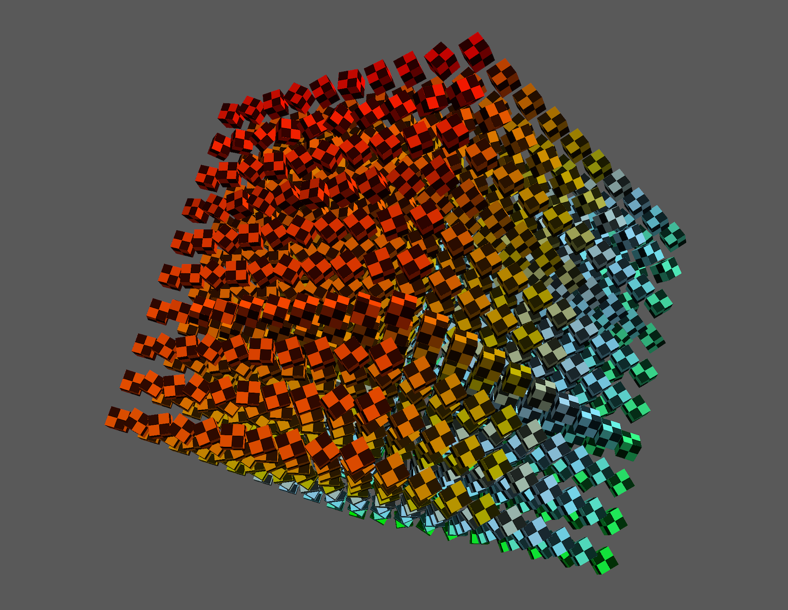

# Learning Metal with metal-cpp

Learn Metal using **metal-cpp**.

## Overview



This project contains a series of samples written in C++ that introduce the Metal API and show how to accomplish common tasks with it.

Each sample incrementally extends upon the previous one with minimal changes to the code to introduce new functionality. You can use the `diff` tool to visualize the exact code changes necessary to implement this functionality.

This README presents how to build the project and describes how each sample accomplishes a specific task using Metal.

The project demonstrates how to incrementally achieve the following tasks:

* 00 - window : Create a Window for Metal Rendering
* 01 - primitive : Render a Triangle
* 02 - argbuffers : Store Shader Arguments in a Buffer
* 03 - animation : Animate Rendering
* 04 - instancing : Draw Multiple Instance of an Object
* 05 - perspective : Render 3D with Perspective Projection
* 06 - lighting : Light Geometry
* 07 - texturing : Texture Triangles
* 08 - compute : Use the GPU for General Purpose Computation
* 09 - compute-to-render : Render the Results of a Compute Kernel
* 10 - frame-debugging : Capture GPU Commands for Debugging

## Dependencies

These samples include the **metal-cpp** and **metal-cpp-extensions** libraries.

Use either the included Xcode project or the UNIX make utility to build the project.

This project requires C++17 support (available since Xcode 9.3).

## Building with Xcode

Open the `LearnMetalCPP.xcodeproj` project with Xcode.

The project contains a target for each sample and an aggregate target to build them all at once. Use the scheme drop-down menu next to the "Run" button to select which sample to build and run.

## Building with Make

To build the samples using a Makefile, open the terminal and run the `make` command. The build process will put the executables into the `build/` folder.

By default, the Makefile compiles the source with the `-O2` optimization level. Pass the following options to make change the build configuration:

* `DEBUG=1` : disable optimizations and include symbols (`-g`).
* `ASAN=1` : build with address sanitizer support (`-fsanitize=address`).

## Sample 0: Create a Window for Metal Rendering

The `00-window` sample shows how to create a macOS application with a window capable of displaying content drawn using Metal. This sample clears the contents of the window to a solid red color.

The program starts in the `main` function.

``` other
MyAppDelegate del;

NS::Application* pSharedApplication = NS::Application::sharedApplication();
pSharedApplication->setDelegate( &del );
pSharedApplication->run();
```

In order to create the window, the app obtains the global shared application object and sets a custom application delegate (an instance of a subclass of `NS::ApplicationDelegate`). The delegate receives notifications of system events and, in particular, responds when the application has finished launching and is ready to create its window.

The notification of this event arrives in the `applicationDidFinishLaunching()` method. The sample overrides this method and creates the window, a menu, and the Metal-capable content view.

The sample uses the `MTK::View` class to display Metal content in a window. `MTK::View` also provides a runtime loop that triggers rendering at a regular cadence. The `applicationDidFinishLaunching()` method initializes the view with a `CGRect` describing its dimensions and a `MTL::Device` object, a software representation of the system's GPU. This method also specifies a pixel format for the view's drawable render target and sets a color with which to clear the drawable each frame.

``` other
_pMtkView = MTK::View::alloc()->init( frame, _pDevice );
_pMtkView->setColorPixelFormat( MTL::PixelFormat::PixelFormatBGRA8Unorm_sRGB );
_pMtkView->setClearColor( MTL::ClearColor::Make( 1.0, 0.0, 0.0, 1.0 ) );
```

The method also sets an instance of the `MyMTKViewDelegate` class as a delegate.

``` other
_pViewDelegate = new MyMTKViewDelegate( _pDevice );
_pMtkView->setDelegate( _pViewDelegate );
```

`MyMTKViewDelegate` is a subclass of the `MTK::ViewDelegate` class. `MTK::ViewDelegate` provides an interface to which the `MTK::View` can forward events. By overriding the virtual functions of its parent class, `MyMTKViewDelegate` can respond to these events. `MTK::View` calls the `drawInMTKView()` method each frame allowing the app to update any rendering.

``` other
void MyMTKViewDelegate::drawInMTKView( MTK::View* pView )
{
    _pRenderer->draw( pView );
}
```

`drawInMTKView()` simply calls the `Renderer` class's `draw()` method.  The `draw()` method performs the minimal work necessary to clear the view's color.

``` other
MTL::CommandBuffer* pCmd = _pCommandQueue->commandBuffer();
MTL::RenderPassDescriptor* pRpd = pView->currentRenderPassDescriptor();
MTL::RenderCommandEncoder* pEnc = pCmd->renderCommandEncoder( pRpd );
pEnc->endEncoding();
pCmd->presentDrawable( pView->currentDrawable() );
pCmd->commit();
```

It performs the following actions:

1. Create a command buffer object.  This allows the app to encode commands for execution by the GPU.
2. Create a render command encoder object.  This prepares the command buffer to receive drawing commands and specifies the actions to perform when drawing starts and ends.
3. Present the *current drawable.* This encodes a command to make the results of the GPU’s work visible on the screen.
4. Submit the command buffer to its command queue. This submits the encoded commands to the GPU for execution.

In this sample, the `MTLRenderCommandEncoder` object does not explicitly encode any commands. However, the `MTL::RenderPassDescriptor` object used to create the encoder implicitly encodes a clear command. This command produces the solid red color on the view.

* Note: Metal relies on temporary *autoreleased* objects. The sample creates a `NS:AutoreleasePool` object at the beginning of each frame to manage these objects. This pool tracks these temporary objects and frees them when the pool destructor is called at the end of the frame. See the **metal-cpp** documentation for more details.

## Sample 1: Render a Triangle

The `01-Primitive` sample builds on the `Renderer` object created in the previous sample to draw a triangle.

Before issuing a draw command, the renderer must describe the configuration of a *render pipeline*. The renderer uses an `MTL::RenderPipelineState` object to define how the GPU should process the geometry drawn. The render pipeline is also where the sample specifies *vertex* and *fragment* shaders.

Shaders are small programs that specify the GPU's operation. The vertex shader specifies how the GPU should transform vertices of the triangle, while the fragment shader specifies the final color of the triangle's pixels. The renderer's `buildShaders()` member function builds a `MTL::RenderPipelineState` object from a pair of vertex and fragment shaders stored in the `shaderSrc` string.

Metal uses a special-purpose language called the *Metal Shading Language* (MSL) to specify the vertex and fragment shaders. MSL is a derivative of C++ 14 which depends on a number of attribute specifiers to specify how Metal can interpret the language for execution on a GPU. A Metal Xcode project typically has a number of *.metal* source files containing MSL programs. Xcode would compile these *.metal* files along with the rest of the project's source code at build tine. However, for simplicity, this sample directly provides the shader source as a string embedded in the code. Using this string, the renderer creates a `MTL::Library` object.

``` other
MTL::Library* pLibrary = _pDevice->newLibrary( NS::String::string(shaderSrc, UTF8StringEncoding), nullptr, &pError );
if ( !pLibrary )
{
    __builtin_printf( "%s", pError->localizedDescription()->utf8String() );
    assert( false );
}

MTL::Function* pVertexFn = pLibrary->newFunction( NS::String::string("vertexMain", UTF8StringEncoding) );
MTL::Function* pFragFn = pLibrary->newFunction( NS::String::string("fragmentMain", UTF8StringEncoding) );
```

This builds an intermediate representation of the shader code. Then the renderer obtains `MTL::Function` objects from the `MTL::Library` by calling `newFunction()` with the shader function names.

Next, the renderer creates an `MTL::RenderPipelineDescriptor` object to designate the two shaders the pipeline should use. It also specifies the pixel format used by `MTK::View`.

``` other
MTL::RenderPipelineDescriptor* pDesc = MTL::RenderPipelineDescriptor::alloc()->init();
pDesc->setVertexFunction( pVertexFn );
pDesc->setFragmentFunction( pFragFn );
pDesc->colorAttachments()->object(0)->setPixelFormat( MTL::PixelFormat::PixelFormatBGRA8Unorm_sRGB );
```

With the descriptor object, the renderer uses the `MTL::Device` object to create a concrete `MTL::RenderPipelineState` object via the `newRenderPipelineState()` method.

``` other
_pPSO = _pDevice->newRenderPipelineState( pDesc, &pError );
if ( !_pPSO )
{
    __builtin_printf( "%s", pError->localizedDescription()->utf8String() );
    assert( false );
}
```

`MTL::RenderPipelineState` objects are expensive to create since Metal must invoke a compiler to convert the shader to GPU machine code. It is a best practice to build a pipeline once, either during application start or at a point where users expect a load operation to occur.

The renderer also specifies a position and color for each vertex of the triangle. It stores this data in Metal *buffer* objects.

Buffers are unstructured memory allocations accessible by the GPU. An app can interpret buffer data however it likes. In the sample, the renderer uses two buffers to pass vertex data to the vertex shader. The first buffer stores an array of three `sims::float3` vectors, which specify the 3D positions of the vertices. The second buffer also stores an array of three `simd::float3` vectors, which specify RGB color values for each vertex.

``` other
simd::float3 positions[NumVertices] =
{
    { -0.8f,  0.8f, 0.0f },
    {  0.0f, -0.8f, 0.0f },
    { +0.8f,  0.8f, 0.0f }
};

simd::float3 colors[NumVertices] =
{
    {  1.0, 0.3f, 0.2f },
    {  0.8f, 1.0, 0.0f },
    {  0.8f, 0.0f, 1.0 }
};
```

The renderer creates buffer objects to store each of these arrays.

``` other
const size_t positionsDataSize = NumVertices * sizeof( simd::float3 );
const size_t colorDataSize = NumVertices * sizeof( simd::float3 );

MTL::Buffer* pVertexPositionsBuffer = _pDevice->newBuffer( positionsDataSize, MTL::ResourceStorageModeManaged );
MTL::Buffer* pVertexColorsBuffer = _pDevice->newBuffer( colorDataSize, MTL::ResourceStorageModeManaged );

_pVertexPositionsBuffer = pVertexPositionsBuffer;
_pVertexColorsBuffer = pVertexColorsBuffer;
```

The renderer creates these buffers using `MTL::ResourceStorageModeManaged`. This indicates that both the CPU and GPU can directly access the contents of the buffer. This allows the renderer to fill the buffers' contents with the arrays by calling `memcpy()`.

``` other
memcpy( _pVertexPositionsBuffer->contents(), positions, positionsDataSize );
memcpy( _pVertexColorsBuffer->contents(), colors, colorDataSize );

_pVertexPositionsBuffer->didModifyRange( NS::Range::Make( 0, _pVertexPositionsBuffer->length() ) );
_pVertexColorsBuffer->didModifyRange( NS::Range::Make( 0, _pVertexColorsBuffer->length() ) );
```

The renderer indicates to Metal that the CPU has written data to the buffer contents by calling the buffers' `didModifyRange()` method.

Once the renderer creates the render pipeline and buffer objects, it can begin encoding commands to draw the triangle. This sample extends upon the previous sample's `draw()` function by explicitly encoding commands to do this.

``` other
MTL::RenderCommandEncoder* pEnc = pCmd->renderCommandEncoder( pRpd );

pEnc->setRenderPipelineState( _pPSO );
pEnc->setVertexBuffer( _pVertexPositionsBuffer, 0, 0 );
pEnc->setVertexBuffer( _pVertexColorsBuffer, 0, 1 );
pEnc->drawPrimitives( MTL::PrimitiveType::PrimitiveTypeTriangle, NS::UInteger(0), NS::UInteger(3) );

pEnc->endEncoding();
```

After the function creates the render command encoder, it calls the encoder's `setRenderPipelineState()` method. It then sets the buffers' containing vertex positions and colors so that Metal passes them as arguments to the vertex shader.

In the vertex shader function, the `positions` and `colors`  parameters use the `[[buffer(0)]]` and `[[buffer(1)]]` attributes. The sample calls `setVertexBuffer()` using the indices declared with these attributes to pass the buffers to these parameters.

``` other
v2f vertex vertexMain( uint vertexId [[vertex_id]],
                       device const float3* positions [[buffer(0)]],
                       device const float3* colors [[buffer(1)]] )
```

Once the `draw()` method sets the vertex buffers, it encodes a draw command with a call to the encoder's `drawPrimitives()` method. The `drawPrimitives()` method draws a triangle using the render pipeline with the three vertices in the set buffers.

## Sample 2: Store Shader Arguments in a Buffer

The `02-argbuffers` sample builds on the previous sample and add an *argument buffer* to indirectly provide buffers to the vertex shader. Argument buffers are a particular type of buffer that contain references to Metal resource objects, including other buffers.

This sample extends upon the `buildBuffers()` method and builds an argument buffer that contains references to the vertex position and color buffers.

The renderer must first create an argument encoder from one of the parameters of the shader. It does this by calling the shader function's `newArgumentEncoder()` method with the index of the buffer parameter it wishes to encode.

``` other
MTL::Function* pVertexFn = _pShaderLibrary->newFunction( NS::String::string( "vertexMain", UTF8StringEncoding ) );
MTL::ArgumentEncoder* pArgEncoder = pVertexFn->newArgumentEncoder( 0 );
```

The encoder object interprets a parameter's memory requirements and layout based on the parameter's type. Using the value returned by the encoder's `encodedLength()` method, the renderer creates an argument buffer. This ensures the buffer is large enough to encode arguments into.

``` other
MTL::Buffer* pArgBuffer = _pDevice->newBuffer( pArgEncoder->encodedLength(), MTL::ResourceStorageModeManaged );
```

The renderer then binds the argument buffer to the argument encoder via the `setArgumentBuffer()` method. This specifies the destination to which the encoder writes the object references.

``` other
pArgEncoder->setArgumentBuffer( _pArgBuffer, 0 );
```

With the buffer objects created and set, the renderer encodes references to the position data in index `0` and to the color data in  index `1`.

``` other
pArgEncoder->setBuffer( _pVertexPositionsBuffer, 0, 0 );
pArgEncoder->setBuffer( _pVertexColorsBuffer, 0, 1 );
```

The indices used with `setBuffer()` correspond to numbers used with the `[[id()]]` attribute specifier in the shader code.

``` other
struct VertexData
{
    device float3* positions [[id(0)]];
    device float3* colors [[id(1)]];
};
```

With the buffers ready, the renderer can begin encoding render commands. First, it makes the argument buffer available to the vertex shader.

``` other
pEnc->setVertexBuffer( _pArgBuffer, 0, 0 );
pEnc->useResource( _pVertexPositionsBuffer, MTL::ResourceUsageRead );
pEnc->useResource( _pVertexColorsBuffer, MTL::ResourceUsageRead );
```

The renderer must call the `useResource()` method because the shader indirectly references these vertex data buffers through the argument buffer. This indicates to Metal that the buffer needs to be present in memory when executing the command buffer.

The vertex shader accesses the vertex buffers indirectly via the `vertexData` argument buffer.

``` other
o.position = float4( vertexData->positions[ vertexId ], 1.0 );
o.color = half3(vertexData->colors[ vertexId ]);
```

The shader indexes into these vertex buffers to retrieve a position and color value for each vertex.

## Sample 3: Animate Rendering

The `03-animation` builds on the previous sample by adding an animation to spin the triangle.

To accomplish this, the sample passes a value specifying a rotation angle to the vertex shader. The shader uses this angle to construct a rotation matrix, which transforms the vertices in the vertex stage.

Unlike the vertex data that defines the primitive's vertex positions and colors, the animation consists of a single value that is constant (i.e. *uniform*) across all vertices processed.

To provide this data, the sample defines the `FrameData` structure that contains a single `float` variable.

``` other
struct FrameData
{
    float angle;
};
```

Both the vertex shader written in MSL, and the host code, written in C++, declare the structure since both need access to the `angle` parameter.

Metal provides a convenient method to pass small amounts of data to shaders via the `setVertexBytes()` method. The `FrameData` structure is small enough that the sample *could* use `setVertexBytes()` to pass it to the vertex shader. However, passing larger amounts of data requires using `MTL::Buffer` objects. To demonstrate passing a large amount of data, the sample passes the `FrameData` structure using a series of  Metal buffers.

``` other
for ( int i = 0; i < Renderer::kMaxFramesInFlight; ++i )
{
    _pFrameData[ i ]= _pDevice->newBuffer( sizeof( FrameData ), MTL::ResourceStorageModeManaged );
}
```

The `buildFrameData()` function creates `kMaxFramesInFlight` or `3` buffers to store three versions of the FrameData structure. The renderer uses multiple versions of these buffers to avoid a data race condition where the CPU writes a new value to the buffer while the GPU simultaneously reads from the buffer.  It cycles through three buffers which allows the CPU to update one buffer while GPU reads from another.

``` other
_frame = (_frame + 1) % Renderer::kMaxFramesInFlight;
MTL::Buffer* pFrameDataBuffer = _pFrameData[ _frame ];
```

The renderer uses a *semaphore* to explicitly synchronize buffer updates. This ensures that the CPU isn't updating the same buffer the GPU reads from.

Upon initialization, the renderer creates the semaphore with a value of `kMaxFramesInFlight`.

``` other
_semaphore = dispatch_semaphore_create( Renderer::kMaxFramesInFlight );
```

At the beginning of each frame, the renderer calls `dispatch_semaphore_wait()`. This forces to CPU to wait if the GPU has not finished reading from the next buffer in the the cycle.

``` other
dispatch_semaphore_wait( _semaphore, DISPATCH_TIME_FOREVER );
```

The renderer receives a notification that the GPU has finished processing each command buffer via a *completed handler* closure.  

``` other
Renderer* pRenderer = this;
pCmd->addCompletedHandler( ^void( MTL::CommandBuffer* pCmd ){
    dispatch_semaphore_signal( pRenderer->_semaphore );
});
```

Completed handlers are closures that Metal invokes when the GPU completes execution of the command buffer. The renderer sets up this completed handler to call  `dispatch_semaphore_signal()`. 

Once the renderer has a buffer it can safely use, it overwrites the buffer’s contents with a new value. Because these are managed storage buffers, the sample must notify Metal of the content change.

``` other
reinterpret_cast< FrameData * >( pFrameDataBuffer->contents() )->angle = (_angle += 0.01f);
pFrameDataBuffer->didModifyRange( NS::Range::Make( 0, sizeof( FrameData ) ) );
```

Finally, to implement the animation, the sample extends the vertex shader to retrieve the angle variable, calculate the rotation matrix, and transform the vertex positions.

``` other
float a = frameData->angle;
float3x3 rotationMatrix = float3x3( sin(a), cos(a), 0.0, cos(a), -sin(a), 0.0, 0.0, 0.0, 1.0 );
v2f o;
o.position = float4( rotationMatrix * vertexData->positions[ vertexId ], 1.0 );
```

Because the angle is slowly updated every frame, it produces the gentle roll rotation of the triangle.

## Sample 4: Draw Multiple Instances of an Object

The `04-instancing` sample builds on the previous one to add *instancing*. This enables it to draw multiple primitives from a single draw command.

Issuing a single draw call incurs some amount of overhead. With instancing, Metal can draw an object multiple times in a single draw call, reducing the number of calls required to render a scene.

The renderer provides each instance with a unique value for positions and colors.  The renderer's `buildBuffers()` method creates a buffer that holds this data.

``` other
for ( size_t i = 0; i < kMaxFramesInFlight; ++i )
{
    _pInstanceDataBuffer[ i ] = _pDevice->newBuffer( instanceDataSize, MTL::ResourceStorageModeManaged );
}
```

Similar to how the previous sample used the `_pFrameData` variable, this sample leverages three buffers for instance data to avoid race conditions between the CPU and GPU.

Each frame, the renderer cycles to the next instance buffer.  It then iterates through each instance, calculating a new position, and updating the values in ``_pInstanceDataBuffer``.

``` other
shader_types::InstanceData* pInstanceData = reinterpret_cast< shader_types::InstanceData *>( pInstanceDataBuffer->contents() );
for ( size_t i = 0; i < kNumInstances; ++i )
{
    float iDivNumInstances = i / (float)kNumInstances;
    float xoff = (iDivNumInstances * 2.0f - 1.0f) + (1.f/kNumInstances);
    float yoff = sin( ( iDivNumInstances + _angle ) * 2.0f * M_PI);
    pInstanceData[ i ].instanceTransform = (float4x4){ (float4){ scl * sinf(_angle), scl * cosf(_angle), 0.f, 0.f },
                                                       (float4){ scl * cosf(_angle), scl * -sinf(_angle), 0.f, 0.f },
                                                       (float4){ 0.f, 0.f, scl, 0.f },
                                                       (float4){ xoff, yoff, 0.f, 1.f } };

    float r = iDivNumInstances;
    float g = 1.0f - r;
    float b = sinf( M_PI * 2.0f * iDivNumInstances );
    pInstanceData[ i ].instanceColor = (float4){ r, g, b, 1.0f };
}
```

With these buffers filled with up-to-date instance data, the `draw()` method encodes rendering commands.

``` other
pEnc->setVertexBuffer( pInstanceDataBuffer, /* offset */ 0, /* index */ 1 );

//
// void drawIndexedPrimitives( PrimitiveType primitiveType, NS::UInteger indexCount, IndexType indexType,
//                             const class Buffer* pIndexBuffer, NS::UInteger indexBufferOffset, NS::UInteger instanceCount );
pEnc->drawIndexedPrimitives( MTL::PrimitiveType::PrimitiveTypeTriangle,
                            6, MTL::IndexType::IndexTypeUInt16,
                            _pIndexBuffer,
                            0,
                            kNumInstances );
```

The renderer supplies the instance data to the vertex shader with a call to `setVertexBuffer()`.  It then issues a draw call with `drawIndexPrimitives()`.   By passing in `kNumInstances` or `32` to the `instanceCount` parameter of the method, Metal draws the object 32 times.

Within the vertex shader, the sample determines what instance each vertex belongs to and retrieves the data specific to its instance.

``` other
v2f vertex vertexMain( device const VertexData* vertexData [[buffer(0)]],
                       device const InstanceData* instanceData [[buffer(1)]],
                       uint vertexId [[vertex_id]],
                       uint instanceId [[instance_id]] )
{
    v2f o;
    float4 pos = float4( vertexData[ vertexId ].position, 1.0 );
    o.position = instanceData[ instanceId ].instanceTransform * pos;
    o.color = half3( instanceData[ instanceId ].instanceColor.rgb );
    return o;
}
```

The `[[instance_id]]` attribute in MSL contains the value of the instance as provided by the runtime. The sample uses this value to index into the `instanceData` buffer, which provides each instance's position and color.

## Sample 5: Render 3D with Perspective Projection

The `05-perspective` sample builds on the previous sample by adding the illusion of depth to rendered objects.

Metal does not provide any intrinsic functionality to draw 3D objects. Instead, you create the illusion of the camera seeing the world in 3D by using a perspective transformation matrix.

First, the sample creates a structure suitable to pass the perspective and world transformation matrices to the GPU.

``` other
struct CameraData
{
    simd::float4x4 perspectiveTransform;
    simd::float4x4 worldTransform;
};
```

So far, in previous samples, objects have been two-dimensional. In those samples, draw order is sufficient to establish which pixels are visible when the triangles overlap. However, for 3D objects to look correct, the renderer needs to ensure the pixels closest to the camera are visible, not the pixels drawn most recently. For this, Metal can perform a *depth comparison* operation to place closer pixels on top of those further away.

The renderer specifies how Metal should execute the depth comparison using a `MTL::DepthStencilState` object.

``` other
void Renderer::buildDepthStencilStates()
{
    MTL::DepthStencilDescriptor* pDsDesc = MTL::DepthStencilDescriptor::alloc()->init();
    pDsDesc->setDepthCompareFunction( MTL::CompareFunction::CompareFunctionLess );
    pDsDesc->setDepthWriteEnabled( true );

    _pDepthStencilState = _pDevice->newDepthStencilState( pDsDesc );

    pDsDesc->release();
}
```

As the pipeline processes triangles and generates fragments, it uses the `depthCompareFunction` property to determine whether it should discard a fragment based on its distance from the camera. By setting this property to `MTL::CompareFunctionLess`, the renderer signals that Metal should only write the fragment to the view if it's closer to the camera. By enabling `depthWrite`, the pipeline updates the pixel's depth value for future comparisons.

Before rendering each frame, the `draw()` method computes the camera's matrices to apply a perspective projection.

``` other
MTL::Buffer* pCameraDataBuffer = _pCameraDataBuffer[ _frame ];
shader_types::CameraData* pCameraData = reinterpret_cast< shader_types::CameraData *>( pCameraDataBuffer->contents() );
pCameraData->perspectiveTransform = math::makePerspective( 45.f * M_PI / 180.f, 1.f, 0.03f, 500.0f ) ;
pCameraData->worldTransform = math::makeIdentity();
pCameraDataBuffer->didModifyRange( NS::Range::Make( 0, sizeof( shader_types::CameraData ) ) );
```

The vertex shader multiplies the 3D vertex positions by these matrices to compute a position to output for each vertex.

``` other
pos = cameraData.perspectiveTransform * cameraData.worldTransform * pos;
```

The `draw()` method sets the depth stencil state and passes the updated camera matrices to the vertex shader.

``` other
pEnc->setVertexBuffer( _pVertexDataBuffer, /* offset */ 0, /* index */ 0 );
pEnc->setVertexBuffer( pInstanceDataBuffer, /* offset */ 0, /* index */ 1 );
pEnc->setVertexBuffer( pCameraDataBuffer, /* offset */ 0, /* index */ 2 );
```

The `draw()` method also sets the polygon winding order and enables back face culling. This is an important optimization which allows Metal to avoid drawing the interior geometry of 3D objects.

``` other
pEnc->setCullMode( MTL::CullModeBack );
pEnc->setFrontFacingWinding( MTL::Winding::WindingCounterClockwise );
```

Finally, with all the buffers bound and render states set, the renderer calls the `drawIndexedPrimitives()` method.

## Sample 6: Light Geometry

The `06-Lighting` sample builds on the previous one to adding the illusion of lighted surface.

The sample declares the `VertexData` structure with an additional vertex attribute, called a *normal*.  The equations to produce lighting effects use this normal attribute to determine the amount of light to apply. Both the host C++ code and GPU MSL code declare this structure so their memory layout match in both languages.

``` other
struct VertexData
{
    simd::float3 position;
    simd::float3 normal;
};
```

The renderer's `buildBuffers()` method uses this `VertexData` structure to define the vertices a cube with the `verts` array.

``` other
shader_types::VertexData verts[] = {
    //   Positions          Normals
    { { -s, -s, +s }, { 0.f,  0.f,  1.f } },
    { { +s, -s, +s }, { 0.f,  0.f,  1.f } },
    { { +s, +s, +s }, { 0.f,  0.f,  1.f } },
    { { -s, +s, +s }, { 0.f,  0.f,  1.f } },

    { { +s, -s, +s }, { 1.f,  0.f,  0.f } },
    { { +s, -s, -s }, { 1.f,  0.f,  0.f } },
    { { +s, +s, -s }, { 1.f,  0.f,  0.f } },
    { { +s, +s, +s }, { 1.f,  0.f,  0.f } },

    { { +s, -s, -s }, { 0.f,  0.f, -1.f } },
    { { -s, -s, -s }, { 0.f,  0.f, -1.f } },
    { { -s, +s, -s }, { 0.f,  0.f, -1.f } },
    { { +s, +s, -s }, { 0.f,  0.f, -1.f } },

    { { -s, -s, -s }, { -1.f, 0.f,  0.f } },
    { { -s, -s, +s }, { -1.f, 0.f,  0.f } },
    { { -s, +s, +s }, { -1.f, 0.f,  0.f } },
    { { -s, +s, -s }, { -1.f, 0.f,  0.f } },

    { { -s, +s, +s }, { 0.f,  1.f,  0.f } },
    { { +s, +s, +s }, { 0.f,  1.f,  0.f } },
    { { +s, +s, -s }, { 0.f,  1.f,  0.f } },
    { { -s, +s, -s }, { 0.f,  1.f,  0.f } },

    { { -s, -s, -s }, { 0.f, -1.f,  0.f } },
    { { +s, -s, -s }, { 0.f, -1.f,  0.f } },
    { { +s, -s, +s }, { 0.f, -1.f,  0.f } },
    { { -s, -s, +s }, { 0.f, -1.f,  0.f } },
};
```

The sample extends the interface between the vertex and the fragment stages in MSL. Metal interpolates the normal attribute across the surface of each triangle, providing each fragment with its own interpolated normal value.

``` other
struct v2f
{
    float4 position [[position]];
    float3 normal;
    half3 color;
};
```

The fragment shader uses the interpolated normal to calculate the lit color of the fragment using a simple Lambert illumination model.

``` other
half4 fragment fragmentMain( v2f in [[stage_in]] )
{
    // assume light coming from (front-top-right)
    float3 l = normalize(float3( 1.0, 1.0, 0.8 ));
    float3 n = normalize( in.normal );

    float ndotl = saturate( dot( n, l ) );
    return half4( in.color * 0.1 + in.color * ndotl, 1.0 );
}
```

## Sample 7: Texture Surfaces

The `07-texturing` sample adds the ability to apply a texture (i.e. an image) onto the face of the rendered cubes.

In order to draw a texture, the code needs 3 things: 

1. An image accessible to the GPU.
2. Data showing Metal how to place the image upon each triangle 
3. Operations to apply the image to the rendered pixels

To create the image and make it available to the GPU, the sample introduces the `buildTextures()` function.

To create a texture in Metal, use the `MTL::TextureDescriptor` class. The descriptor provides information about the texture to create such as `width` and `height` of the image, its `pixelFormat`, `textureType`, `storageMode`, and `usage`. The renderer creates a texture from the `MTL::Device` object using this descriptor.

``` other
MTL::TextureDescriptor* pTextureDesc = MTL::TextureDescriptor::alloc()->init();
pTextureDesc->setWidth( tw );
pTextureDesc->setHeight( th );
pTextureDesc->setPixelFormat( MTL::PixelFormatRGBA8Unorm );
pTextureDesc->setTextureType( MTL::TextureType2D );
pTextureDesc->setStorageMode( MTL::StorageModeManaged );
pTextureDesc->setUsage( MTL::ResourceUsageSample | MTL::ResourceUsageRead );

MTL::Texture *pTexture = _pDevice->newTexture( pTextureDesc );
_pTexture = pTexture;
```

This creates the object and allocates memory for the image. The renderer must still fill the memory with image data.

Typically, an application will fill the texture’s memory with data from an image file. Metal doesn't provide an API to load image data from files so apps must use custom code or an API which handles images such MetalKit or Image I/O. Instead of relying on such an API, this sample implements a simple algorithm to generate a checkerboard pattern. It allocates a temporary system memory buffer using `alloca` and then generates the image.

``` other
uint8_t* pTextureData = (uint8_t *)alloca( tw * th * 4 );
```

Once the renderer has filled the temporary allocation, it copies the data to the texture object using the `replaceRegion()` method.

``` other
_pTexture->replaceRegion( MTL::Region( 0, 0, 0, tw, th, 1 ), 0, pTextureData, tw * 4 );
```

Just like pipeline objects, textures are expensive to create. Create them once and reuse them as much as possible.

Once the renderer creates the texture, it must establish how Metal should place the image onto the cube faces. To accomplish this, the sample adds a *texture coordinate* attribute to each vertex.

The sample extends the `VertexData` structure to include a texture coordinate alongside vertex positions and normals.

``` other
struct VertexData
{
    simd::float3 position;
    simd::float3 normal;
    simd::float2 texcoord;
};
```

The `buildBuffers()` method specifies a texture coordinate for each vertex in the array.

``` other
shader_types::VertexData verts[] = {
    //                                         Texture
    //   Positions           Normals         Coordinates
    { { -s, -s, +s }, {  0.f,  0.f,  1.f }, { 0.f, 1.f } },
    { { +s, -s, +s }, {  0.f,  0.f,  1.f }, { 1.f, 1.f } },
    { { +s, +s, +s }, {  0.f,  0.f,  1.f }, { 1.f, 0.f } },
    { { -s, +s, +s }, {  0.f,  0.f,  1.f }, { 0.f, 0.f } },

    { { +s, -s, +s }, {  1.f,  0.f,  0.f }, { 0.f, 1.f } },
    { { +s, -s, -s }, {  1.f,  0.f,  0.f }, { 1.f, 1.f } },
    { { +s, +s, -s }, {  1.f,  0.f,  0.f }, { 1.f, 0.f } },
    { { +s, +s, +s }, {  1.f,  0.f,  0.f }, { 0.f, 0.f } },

    { { +s, -s, -s }, {  0.f,  0.f, -1.f }, { 0.f, 1.f } },
    { { -s, -s, -s }, {  0.f,  0.f, -1.f }, { 1.f, 1.f } },
    { { -s, +s, -s }, {  0.f,  0.f, -1.f }, { 1.f, 0.f } },
    { { +s, +s, -s }, {  0.f,  0.f, -1.f }, { 0.f, 0.f } },

    { { -s, -s, -s }, { -1.f,  0.f,  0.f }, { 0.f, 1.f } },
    { { -s, -s, +s }, { -1.f,  0.f,  0.f }, { 1.f, 1.f } },
    { { -s, +s, +s }, { -1.f,  0.f,  0.f }, { 1.f, 0.f } },
    { { -s, +s, -s }, { -1.f,  0.f,  0.f }, { 0.f, 0.f } },

    { { -s, +s, +s }, {  0.f,  1.f,  0.f }, { 0.f, 1.f } },
    { { +s, +s, +s }, {  0.f,  1.f,  0.f }, { 1.f, 1.f } },
    { { +s, +s, -s }, {  0.f,  1.f,  0.f }, { 1.f, 0.f } },
    { { -s, +s, -s }, {  0.f,  1.f,  0.f }, { 0.f, 0.f } },

    { { -s, -s, -s }, {  0.f, -1.f,  0.f }, { 0.f, 1.f } },
    { { +s, -s, -s }, {  0.f, -1.f,  0.f }, { 1.f, 1.f } },
    { { +s, -s, +s }, {  0.f, -1.f,  0.f }, { 1.f, 0.f } },
    { { -s, -s, +s }, {  0.f, -1.f,  0.f }, { 0.f, 0.f } }
};
```

In the `draw()` function, the renderer sets the texture using the encoder, making the image available to the fragment shader.

``` other
pEnc->setFragmentTexture( _pTexture, /* index */ 0 );
```

The sample also makes a few changes to the shaders.

First, the shader's `v2f` structure includes a texture coordinate to interpolate when passed from the vertex shader to the fragment shader.

``` other
struct v2f
{
    float4 position [[position]];
    float3 normal;
    half3 color;
    float2 texcoord;
};
```

Second, the fragment shader adds a parameter for the texture object.

``` other
half4 fragment fragmentMain( v2f in [[stage_in]], texture2d< half, access::sample > tex [[texture(0)]] )
```

Finally, the fragment shader uses the interpolated texture coordinate to *sample* from the texture.

``` other
constexpr sampler s( address::repeat, filter::linear );
half3 texel = tex.sample( s, in.texcoord ).rgb;
```

This retrieves the texture data and passes it into the `texel` variable. The fragment shader mixes the `texel` color value with the result of the lighting calculations and outputs a final color.

## Sample 8: Use the GPU for General Purpose Computation

The `08-compute` sample builds on the previous samples by leveraging the high bandwidth processing power offered by GPUs for general purpose computation. It uses a *compute* pipeline to generate the texture image on the GPU itself rather than creating it on the CPU.

To generate the texture on the GPU, the sample adds a `kernel` function written in MSL. This compute kernel accepts a texture with `access::write` as a parameter and calculates a color value to write to the texture. The `index` parameter is a 2D vector that the identifies the thread executed by the GPU. This kernel kernel uses `index` to determine x and y coordinate of the texel to write data to. The `gridSize` specifies the total size of the workload.

``` other
kernel void mandelbrot_set(texture2d< half, access::write > tex [[texture(0)]],
                           uint2 index [[thread_position_in_grid]],
                           uint2 gridSize [[threads_per_grid]])
```

Unlike fragment shaders, compute kernels do not output their results to render attachments. Instead, they can directly output texel data with the texture's `write()` method.

``` other
tex.write(half4(color, color, color, 1.0), index, 0);
```

The renderer uses the kernel to create a compute pipeline.

``` other
MTL::Function* pMandelbrotFn = pComputeLibrary->newFunction( NS::String::string("mandelbrot_set", NS::UTF8StringEncoding) );
_pComputePSO = _pDevice->newComputePipelineState( pMandelbrotFn, &pError );
```

Compute pipelines are more simple to build than render pipelines; they only contain a single function and do not need other state set before building them. Note that just like render pipelines, compute pipelines are expensive to create. The best practice is to create them once and reuse them.

In the previous sample, the `buildTextures()` method generates image data using the CPU and fills the texture's memory with the `replaceRegion()` method. In this sample, the renderer calls the `generateMandelbrotTexture()` method, which uses the GPU to fill the texture's memory. The  `generateMandelbrotTexture()` method creates a `MTL::ComputeCommandEncoder`. With this encoder, it sets the compute pipeline, specifies the texture to pass to the kernel, and, finally, executes the kernel with the `dispatchThreads()` method.

``` other
MTL::ComputeCommandEncoder* pComputeEncoder = pCommandBuffer->computeCommandEncoder();

pComputeEncoder->setComputePipelineState( _pComputePSO );
pComputeEncoder->setTexture( _pTexture, 0 );

MTL::Size gridSize = MTL::Size( kTextureWidth, kTextureHeight, 1 );

NS::UInteger threadGroupSize = _pComputePSO->maxTotalThreadsPerThreadgroup();
MTL::Size threadgroupSize( threadGroupSize, 1, 1 );

pComputeEncoder->dispatchThreads( gridSize, threadgroupSize );

pComputeEncoder->endEncoding();
```

To execute a kernel, the renderer explicitly specifies the size of the workload. It specifies this workload with a `MTL::Size` structure using the texture's width and height for the dimensions. The renderer passes this size as an argument to the `dispatchThreads()` function. The renderer also uses the the value returned by the compute pipeline's `maxTotalThreadsPerThreadgroup()` method to indicate a threadgroup size.

Once executed, the compute kernel fills the texture with a Mandelbrot set image. Metal applies this texture to the face of each cube just as it applied the checkerboard texture in the previous sample.

## Sample 9: Mix Compute with Rendering

The `09-compute-to-render` sample augments the previous one to regenerate the texture image each frame using a compute kernel right before issuing rendering commands. This enables implementing an animated texture effect, where a CPU-driven variable controls the zoom level of the Mandelbrot set.

To perform the texture generation in each frame, the sample simply encodes commands with the `generateMandelbrotTeture()` method to the same command buffer used for subsequent rendering commands.

``` other
// Update texture:

generateMandelbrotTexture( pCmd );

// Begin render pass:

MTL::RenderPassDescriptor* pRpd = pView->currentRenderPassDescriptor();
MTL::RenderCommandEncoder* pEnc = pCmd->renderCommandEncoder( pRpd );
```

By default, Metal tracks hazards for buffers and textures so performing compute work to write into a texture just before the GPU renders witht does not require any explicit synchronization.  Metal will detect the write operation on the texture and ensures that and draw calls that sample from that texture wait until the compute work is complete.

This ensures the results are correct, without the need to implement any GPU timeline synchronization logic or resource transitions.

## Sample 10: Capture GPU Commands for Debugging

The `10-frame-debugging` sample builds on the previous one by adding functionality to ease debugging of the Metal code. Specifically, the sample generates a *GPU frame capture*, which is a recording of Metal state and commands that you can examine in Xcode.

This sample triggers a capture under two different conditions: via a menu item, or after a short timeout. In both cases, the sample uses a `MTL::CaptureManager` object to begin the capture from within the renderer's `triggerCapture()` method. The method begins by obtaining the global capture manager and checking if the device supports capturing Metal commands:

``` other
MTL::CaptureManager* pCaptureManager = MTL::CaptureManager::sharedCaptureManager();
success = pCaptureManager->supportsDestination( MTL::CaptureDestinationGPUTraceDocument );
```

A device will only support capturing Metal commands if the application's Info.plist file has the `MetalCaputureEnabled` key set to `true`.

```
<dict>
    <key>MetalCaptureEnabled</key>
    <true/>
</dict>
```

For applications built as part of a bundle, Xcode embeds plists at build time. However apps, such as this sample, which are not part of a bundle, must explicitly link the plist file using the clang linker. The Makefile included with these samples uses the following linker flag to link the plist to this sample's executable.

```
sectcreate __TEXT __info_plist ./10-frame-debugging/Info.plist
```

Next, the renderer creates a `MTL::CaptureDescriptor` object. Here, it specifies that Metal should write the capture data to a file and designates where the file should appear.  It also specifies that Metal should capture all commands executed by the device.   

``` other
MTL::CaptureDescriptor* pCaptureDescriptor = MTL::CaptureDescriptor::alloc()->init();

pCaptureDescriptor->setDestination( MTL::CaptureDestinationGPUTraceDocument );
pCaptureDescriptor->setOutputURL( pURL );
pCaptureDescriptor->setCaptureObject( _pDevice );
```

* Note: it is important that the app has permissions to write a file to the destination, otherwise an error may occur.

The renderer calls the `startCapture()` method to immediately begin capturing commands.

``` other
success = pCaptureManager->startCapture( pCaptureDescriptor, &pError );
```

Until the renderer calls the `stopCapture()` method, Metal records all commands executed by the device.

``` other
MTL::CaptureManager* pCaptureManager = MTL::CaptureManager::sharedCaptureManager();
pCaptureManager->stopCapture();
```

When the capture completes, the sample automatically opens the .gputrace file in Xcode. However, the trace file persists even after the application exits, allowing you to open it anytime later.


