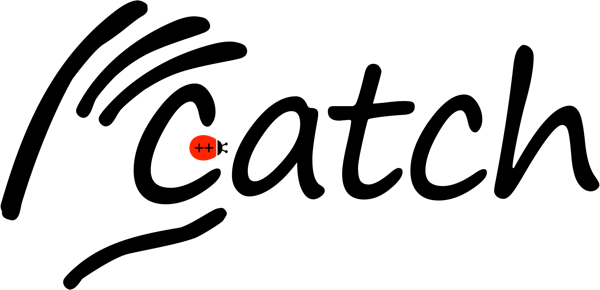

<a href="https://github.com/philsquared/Catch/releases/download/v1.12.2/catch.hpp">The latest, single header, version can be downloaded directly using this link</a>

## What's the Catch?

Catch stands for C++ Automated Test Cases in Headers and is a multi-paradigm automated test framework for C++ and Objective-C (and, maybe, C). It is implemented entirely in a set of header files, but is packaged up as a single header for extra convenience.

## How to use it
This documentation comprises these three parts:

* [Why do we need yet another C++ Test Framework?](docs/why-catch.md)
* [Tutorial](docs/tutorial.md) - getting started
* [Reference section](docs/Readme.md) - all the details

## More
* Issues and bugs can be raised on the [Issue tracker on GitHub](https://github.com/philsquared/Catch/issues)
* For discussion or questions please use [the dedicated Google Groups forum](https://groups.google.com/forum/?fromgroups#!forum/catch-forum)
* See [who else is using Catch](docs/opensource-users.md)

## Help us out
We're currently running [a survey](https://www.surveymonkey.co.uk/r/TLLYQJW) to help us shape the future of Catch.
Please take a few moments to fill it out (there's only ten questions).
